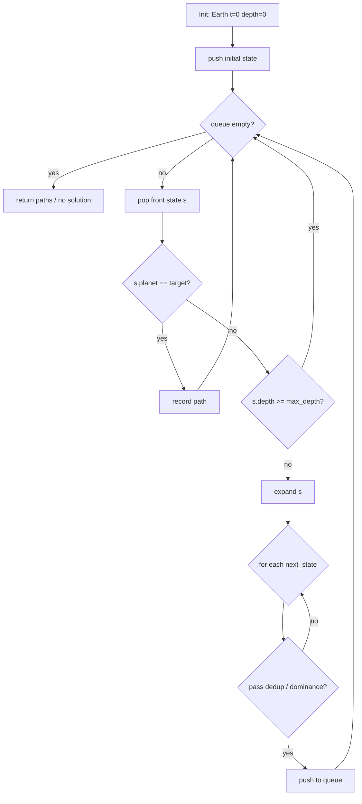
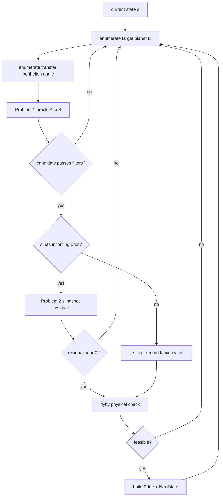

# BFS Trajectory Search Logic

This document describes the **designed search logic** of the `bfs` module: how breadth-first search (BFS) stitches multiple transfers and flybys on a planet network to form feasible Problem 2 trajectories.

> **Implementation status (current codebase)**
>
> - Implemented: search state/edge data structures, angle-frame adapter, Problem 1 oracle, slingshot residual, flyby physical filter
> - **Not implemented**: BFS main loop, `expand_state()`, visit deduplication, path reconstruction
>
> The legacy root-table-backed BFS search has been removed. The current design uses the Problem 1 **direct solver** as Route A oracle.

## 1. Problem Statement

Given:

- Departure planet (typically Earth)
- Target planet (or “visit as many planets as possible”)
- Maximum encounters / maximum search depth
- Optional: time window, max revolutions (k, q), delta-v budget

Find one or more **feasible trajectories** where the spacecraft encounters a sequence of planets, and each encounter satisfies:

1. **Time consistency** (Problem 1): transfer TOF equals target-planet orbital TOF
2. **Slingshot constraint** (Problem 2, intermediate encounters): incoming/outgoing orbits connect via one flyby
3. **Physical feasibility** (trajectory): turn angle, periapsis radius, and v_inf matching are physically allowed

Version 0 only seeks **any feasible path**, without delta-v optimization.

## 2. Search Graph Model

### 2.1 Nodes (states)

Code: `bfs::TrajectorySearchState`

| Field | Meaning |
|-------|---------|
| `current_planet` | Planet just arrived at, ready to depart again |
| `current_time` | Arrival time (seconds since J2000) |
| `incoming_e`, `incoming_theta` | **Incoming** heliocentric orbit at current planet (global periapsis angle) |
| `depth` | Number of completed transfer legs |
| `accumulated_time_seconds` | Total flight time from mission start |
| `launch_v_inf` | Earth departure v_inf (set after first leg) |
| `accumulated_score` | Accumulated cost (depth/time in V0; delta-v in V1+) |
| `valid` | Whether this state is usable |

A node is not a point in space; it is a discrete label: “spacecraft at planet P, time t, with known incoming orbit, ready to plan next leg”.

### 2.2 Edges (transfer legs)

Code: `bfs::TrajectorySearchEdge`

| Field | Meaning |
|-------|---------|
| `from_planet` / `to_planet` | Departure / arrival planet for this leg |
| `departure_time` / `arrival_time` | Leg timing |
| `transfer_time_seconds` | Time of flight |
| `outgoing_e`, `outgoing_p`, `outgoing_theta` | **Outgoing** transfer orbit |
| `theta_prime`, `alpha` | Problem 2 local angles for outgoing-orbit solve |
| `transfer_revolution`, `target_revolution` | Problem 1 (k, q) branch |
| `slingshot_residual` | Slingshot residual when departing with incoming orbit |
| `problem1_residual_seconds` | Problem 1 time residual in seconds |
| `boundary_ambiguous` | Periodic/boundary ambiguity flag |
| `origin_was_topology_change` | Multi-revolution branch topology change |

### 2.3 Expansion result

Code: `bfs::TrajectorySearchExpansionResult`

One `expand(state)` returns:

- `edges[]`: candidate legs generated in this step
- `next_states[]`: successor states paired with `edges[]`
- `ok` / `error_message`: whether expansion succeeded

## 3. BFS Main Loop (design)



### 3.1 Pseudocode

```text
function bfs_search(config):
    queue ← [initial_state(Earth, t=0, depth=0)]
    visited ← empty set
    solutions ← []

    while queue not empty:
        s ← queue.pop_front()

        if s.current_planet == config.target_planet:
            solutions.append(reconstruct_path(s))

        if s.depth >= config.max_depth:
            continue

        expansion ← expand_state(s, config)
        if not expansion.ok:
            continue

        for (edge, next) in zip(expansion.edges, expansion.next_states):
            if not edge.valid or not next.valid:
                continue
            key ← state_key(next, config)
            if key in visited or dominated(next):
                continue
            visited.add(key)
            queue.push_back(next)

    return solutions
```

### 3.2 Visit key (Version 0 draft)

```text
state_key = (
    current_planet,
    round_time_to_bucket(current_time),
    round(incoming_e),
    round(incoming_theta)
)
```

If incoming geometry affects downstream cost/feasibility, upgrade to multi-label search (see `problem2_theory.md`).

## 4. State Expansion: `expand_state`

Core of BFS: for state `s`, enumerate candidate target planets and transfer directions, call oracles.



### 4.1 Problem 1 oracle (Route A)

```cpp
problem1::Problem1SolveInput input{
    .departure_planet = s.current_planet,
    .target_planet = B,
    .launch_time_seconds_since_j2000 = s.current_time,
    .transfer_perihelion_angle = theta_transfer,
    // k, q limits and scan params from global_config
};
auto candidates = problem1::solve_problem1(input);
```

Route B (cached Hessian table) is planned but not implemented; all queries use Route A today.

### 4.2 Build edge and next state

For each accepted `Problem1Candidate` `c`:

```text
edge: A→B, times, outgoing (e,p,theta), (k,q), residuals
next: planet=B, time=arrival, incoming=outgoing of this leg, depth+1
```

## 5. Intermediate Slingshot Constraint

When `s.depth > 0`, verify incoming `(e_in, θ_in)` and outgoing `(e_out, θ_out)` connect via one flyby at planet A:

```cpp
problem2::evaluate_problem2_slingshot_residual(
    phi, e_J, s.incoming_e, s.incoming_theta,
    edge.outgoing_e, edge.outgoing_theta);
```

Angle frames: BFS stores global periapsis angles; use `bfs::global_periapsis_angle_to_problem2_local` when Problem 2 local angles are needed.

## 6. Flyby Physical Filter

```cpp
trajectory::evaluate_flyby_physical_feasibility(
    A, s.current_time,
    s.incoming_e, s.incoming_theta,
    edge.outgoing_e, edge.outgoing_theta,
    options);
```

Rejection reasons: v_inf mismatch, turn angle, periapsis radius.

## 7. First Leg from Earth

Skip slingshot residual at `depth == 0`; optionally compute and cap `launch_v_inf`.

## 8. Termination and Output

| Condition | Action |
|-----------|--------|
| Reach target planet | Record complete path |
| `depth >= max_depth` | Do not expand |
| Queue exhausted | Return solutions or report failure |

Path reconstruction requires a parent pointer (not yet in `TrajectorySearchState`).

## 9. Module Mapping

| Step | Module |
|------|--------|
| Planet state | `planet_params::planet_state_at_time` |
| Transfer candidates | `problem1::solve_problem1` |
| Slingshot | `problem2::evaluate_problem2_slingshot_residual` |
| Flyby physics | `trajectory::evaluate_flyby_physical_feasibility` |
| v_inf | `trajectory::relative_speed_to_planet` |
| Angles | `bfs::global_periapsis_angle_to_problem2_local` |
| Defaults | `config::global_config` |

## 10. Roadmap

| Version | Search | Oracle | Cost | Dedup |
|---------|--------|--------|------|-------|
| V0 | BFS | Route A | uniform | planet+time+incoming |
| V1 | BFS/Dijkstra | B cache + A fallback | time / approx Δv | same |
| V2 | multi-label Dijkstra | same | Δv + time | dominance pruning |
| V3 | multi-label + physics | same | realistic Δv | velocity state |

## 11. Open Questions

1. Allow waiting (self-loop) at a planet?
2. Allow revisiting the same planet?
3. Include (k, q) in state key?
4. How to scan `transfer_perihelion_angle`?
5. First solution vs all solutions vs optimum?

## 12. Planned API (not yet coded)

```cpp
TrajectorySearchExpansionResult expand_state(
    const TrajectorySearchState& state,
    const TrajectorySearchConfig& config);

TrajectorySearchResult bfs_search(const TrajectorySearchConfig& config);
```

`src/bfs/bfs.cpp` is currently a placeholder translation unit.
