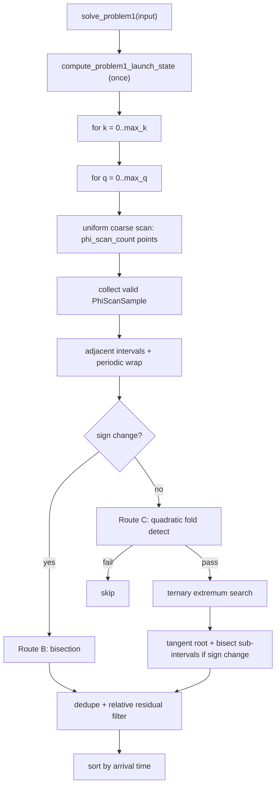

# Problem 1 Solver Status

## Implementation and Role

Active code:

- `include/spaceship_cpp/problem1/problem1.hpp`
- `src/problem1/problem1.cpp`

Entry point: `solve_problem1(const Problem1SolveInput& input)`.

Roles:

- **Correctness baseline** for Problem 1
- Source of transfer-time candidates for tests and diagnostics
- Online solver for BFS first-hop edges (P1-only expansion)

`Problem1Table` is a separate endpoint-geometry / transfer-time table experiment and is **not** used by `solve_problem1`.

---

## Mathematical Problem

Given departure/target planets, launch time `t_launch`, and transfer perihelion angle `θ_A`, define for encounter angle `φ ∈ [0, 2π)`:

\[
f(\varphi) = T_\text{transfer}(\varphi) - T_\text{target}(\varphi)
\]

(scale-free times; roots satisfy \(f \approx 0\)).

**Important:** \(f(\varphi)\) couples to transfer eccentricity \(e(\varphi)\), semilatus rectum \(p(\varphi)\), relative angles, and \(\Delta F(\varphi)\). Derivative estimates and fold handling must use the full `evaluate_problem1_residual()` pipeline.

Revolution branches: enumerate `transfer_revolution = k` and `target_revolution = q`, solve independently on each branch.

---

## Residual Evaluation

1. `compute_problem1_launch_state()` — computed **once** before the φ scan; caches launch-time planet state independent of φ.
2. `evaluate_problem1_residual_with_launch_state()` — full residual for given φ, k, q.
3. `evaluate_problem1_residual()` — public wrapper that builds launch state per call.

Failed evaluations (`InvalidBranch`, `SingularGeometry`, etc.) are **skipped** during coarse scan and do not form scan intervals.

---

## Full Solve Pipeline

### Stage 1 — Coarse scan

| Item | Default |
|------|---------|
| Grid | \(\varphi_i = 2\pi i / N\) |
| `phi_scan_count` \(N\) | **120** (~**3°** per step) |
| Storage | valid `PhiScanSample{phi, result}` only |

After scan: process each interval between consecutive valid samples, plus wrap `[φ_last, φ_first + 2π]`.

Derivative helpers (no extra residual calls): central / forward / backward finite differences via `estimate_problem1_residual_derivative_*`.

### Stage 2 — Route B: sign change → bisection (primary)

Triggered when `residual_sign_changed(f_L, f_R)`.

1. Endpoint hits `residual_tolerance` → direct candidate.
2. Else `bisect_problem1_residual_on_interval_with_launch_state()` (up to 80 iterations).
3. `refine_problem1_root_by_bisection()` → `Problem1Candidate`.

### Stage 3 — Route C: same sign → quadratic fold gate → ternary + bilateral bisection

For intervals with **no sign change**, detect fold/tangent roots.

**Detection** (`detect_fold_interval_by_quadratic_extremum`):

- Geometry: \(f'_L f'_R < 0\) and interior quadratic extremum \(t^* \in (0,1)\)
- Mechanism (either): \(\rho = |\hat f(t^*)|/\max(|f_L|,|f_R|) < 0.5\) **or** \(|\hat f(t^*)|/S < 10^{-4}\)
- **No** endpoint-near-zero gate

**Refinement** (`refine_fold_interval_by_quadratic_extremum`):

1. Ternary search (≤ 48 iterations) for min/max per quadratic estimate
2. Accept extremum if `max_candidate_relative_residual` passes (default \(10^{-6}\))
3. Bisect `[L, φ_ext]` and `[φ_ext, R]` if sign change appears

### Stage 4 — Candidate assembly

- Dedupe by (k, q, φ); keep better relative residual
- Sort by arrival time
- Filter by `max_candidate_relative_residual`

---

## Public Search API

| Function | Purpose |
|----------|---------|
| `estimate_problem1_residual_derivative_*` | finite-difference derivatives |
| `estimate_problem1_residual_quadratic_extremum_on_interval` | Hermite quadratic extremum (closed form) |
| `detect_problem1_fold_interval_by_quadratic_extremum` | fold interval gate |
| `bisect_problem1_residual_on_interval` | bisection on [L, R] |
| `ternary_search_problem1_residual_extremum_on_interval` | ternary extremum search |

Internal `*_with_launch_state` variants reuse cached launch state inside `solve_problem1`.

---

## Default Parameters

| Parameter | Default |
|-----------|---------|
| `phi_scan_count` | **120** |
| `phi_tolerance` | \(10^{-10}\) |
| `max_bisection_iterations` | 80 |
| `max_candidate_relative_residual` | \(10^{-6}\) |
| `max_transfer_revolution` / `max_target_revolution` | 0 |

---

## Correctness and Performance (measured)

Tool: `apps/problem1_scan_compare.cpp`.

- Reference: `phi_scan_count = 2880`
- Default **120**: on Earth→Mars/Venus/Mercury with k,q ∈ {0,0} and {1,1}, **zero missed/extra roots** vs reference
- Speedup vs 2880: roughly **10×–21×** (e.g. Earth→Mars k=q=1: ~0.23 ms vs ~2.7 ms)

---

## Possible Future Optimizations (documented, not implemented)

**Medium payoff**

1. Narrow ternary window around quadratic \(\varphi^*\) instead of full coarse interval
2. Handle gaps when `InvalidBranch` samples are skipped
3. Brent / secant instead of bisection after bracketing
4. Few Newton polish steps after ternary for tangent roots

**Larger changes (BFS scale)**

5. Cache more inside residual hot path (`planet_true_anomaly_at_time`)
6. Parallel (k, q) branches
7. Adaptive local refinement only on suspicious intervals
8. `Problem1Table` lookup for repeated planet-pair queries

**Not recommended now**

- Smaller default `phi_scan_count` without broader validation
- Removing fold route at 120-step scan
- Global 2880 uniform scan as default

---

## Tools and Tests

| Tool | Purpose |
|------|---------|
| `apps/problem1_scan_compare.cpp` | scan-count correctness vs speed |
| `apps/performance_benchmark.cpp` | P1/P2 timing |
| `apps/problem1_profile.cpp` | residual hotspots |
| `tests/problem1/test_problem1_*` | unit and integration tests |

---

## Historical Comparison

| Version | Characteristics |
|---------|-----------------|
| Python `find_all_phi_roots` | coarse scan + sign-change bisection only; fold roots TODO |
| Early C++ | 720-point scan + bisection |
| Dense reference | 2880 + full current algorithm |
| **Current default** | **120 scan + bisection + quadratic fold gate + ternary + bilateral bisection** |
