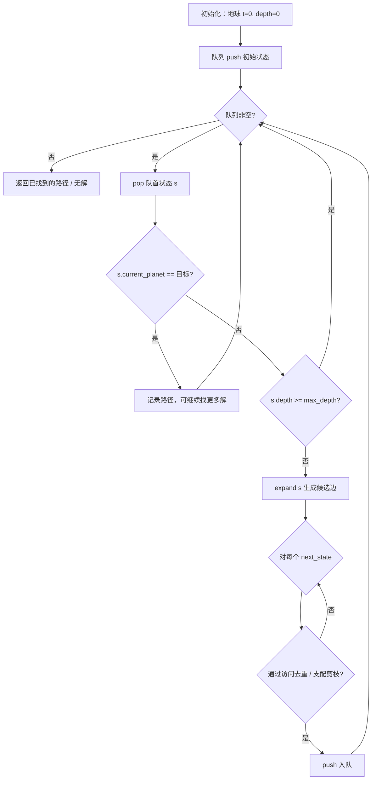
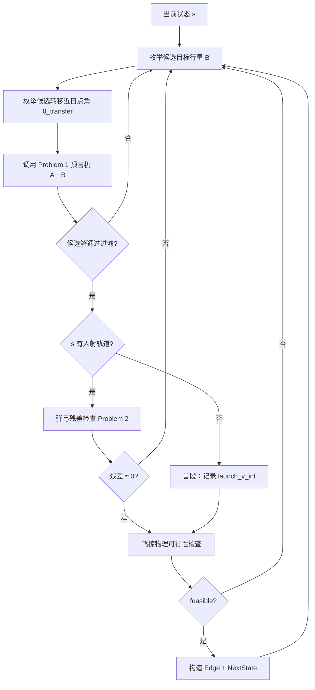

# BFS 轨迹搜索逻辑

本文档描述 `bfs` 模块的**设计搜索逻辑**：如何在行星网络上用广度优先搜索（BFS）拼接多条转移/飞掠，构成 Problem 2 的可行轨迹。

> **实现状态（截至当前代码）**
>
> - 已实现：搜索状态/边数据结构、角度坐标适配、Problem 1 预言机、弹弓残差、飞掠物理过滤
> - **未实现**：BFS 主循环、`expand_state()`、访问去重、路径回溯
>
> 历史上基于根表（root-table）的 BFS 搜索模块已移除；当前设计以 Problem 1 **直接求解器**作为 Route A 预言机。

## 1. 要解决的问题

给定：

- 出发行星（通常为 Earth）
- 目标行星（或「访问尽可能多的行星」）
- 最大遭遇次数 / 最大搜索深度
- 可选：时间窗口、最大多圈数 (k, q)、Δv 预算

求：一条（或多条）**可行轨迹**，使得航天器依次遭遇若干行星，每次遭遇满足：

1. **时间一致性**（Problem 1）：转移轨道飞行时间 = 目标行星轨道飞行时间
2. **弹弓约束**（Problem 2，中间遭遇点）：入射/出射轨道可由同一次飞掠连接
3. **物理可行性**（trajectory）：飞掠转角、近心距、v_∞ 匹配在物理允许范围内

Version 0 的目标仅是**找到可行路径**，不优化 Δv。

## 2. 搜索图模型

### 2.1 节点（状态）

对应代码：`bfs::TrajectorySearchState`

| 字段 | 含义 |
|------|------|
| `current_planet` | 当前所在行星（刚到达，准备再次出发） |
| `current_time` | 到达该行星的时刻（J2000 秒偏移） |
| `incoming_e`, `incoming_theta` | 到达当前行星时的**入射**日心轨道参数（全局近日点角） |
| `depth` | 已完成的转移段数（遭遇次数） |
| `accumulated_time_seconds` | 从任务起点累计的飞行时间 |
| `launch_v_inf` | 从地球出发时的 v_∞（首段转移确定后写入） |
| `accumulated_score` | 累计代价（V0 可设为 depth 或时间；V1+ 可换为 Δv） |
| `valid` | 该状态是否有效 |

**状态语义**：节点不是「太阳系中的一个点」，而是「航天器刚到达某颗行星、携带入射轨道信息、可以规划下一段转移」的离散标签。

### 2.2 边（转移段）

对应代码：`bfs::TrajectorySearchEdge`

| 字段 | 含义 |
|------|------|
| `from_planet` / `to_planet` | 本段转移的出发/目标行星 |
| `departure_time` / `arrival_time` | 出发/到达时刻 |
| `transfer_time_seconds` | 本段飞行时间 |
| `outgoing_e`, `outgoing_p`, `outgoing_theta` | 本段**出射**转移轨道参数 |
| `theta_prime`, `alpha` | Problem 2 外向轨道求解用的局部角（见 §5） |
| `transfer_revolution`, `target_revolution` | Problem 1 的 (k, q) 分支 |
| `slingshot_residual` | 若本段出发行星有入射轨道，记录弹弓残差 |
| `problem1_residual_seconds` | Problem 1 时间残差（秒） |
| `boundary_ambiguous` | 周期边界/分支歧义标记 |
| `origin_was_topology_change` | 是否经历轨道拓扑变化（多圈分支切换） |

### 2.3 扩展结果

对应代码：`bfs::TrajectorySearchExpansionResult`

一次 `expand(state)` 返回：

- `edges[]`：本步生成的所有候选边
- `next_states[]`：与 `edges[]` 一一对应的下一状态
- `ok` / `error_message`：扩展是否成功

## 3. BFS 主循环（设计）



### 3.1 伪代码

```text
function bfs_search(config):
    queue ← [initial_state(Earth, t=0, depth=0)]
    visited ← empty set
    solutions ← []

    while queue not empty:
        s ← queue.pop_front()

        if s.current_planet == config.target_planet:
            solutions.append(reconstruct_path(s))
            if config.stop_at_first_solution:
                break

        if s.depth >= config.max_depth:
            continue

        expansion ← expand_state(s, config)
        if not expansion.ok:
            continue

        for (edge, next) in zip(expansion.edges, expansion.next_states):
            if not edge.valid or not next.valid:
                continue

            key ← state_key(next, config)
            if key in visited:
                continue
            if dominated_by_existing(next, queue, visited, config):
                continue

            visited.add(key)
            queue.push_back(next)

    return solutions
```

### 3.2 访问去重键（Version 0 草案）

同一 `(planet, time, incoming_geometry)` 只扩展一次。建议键：

```text
state_key = (
    current_planet,
    round_time_to_bucket(current_time, bucket_width),
    round(incoming_e, precision),
    round(incoming_theta, precision)
)
```

> **注意**：若入射几何影响下游 Δv 或可行性，不能只按 `(planet, time)` 去重。此时需保留入射分支信息，升级为多标签搜索（见 `problem2_theory.md`）。

## 4. 状态扩展：`expand_state`

这是 BFS 的核心。对当前状态 `s`，枚举所有候选下一行星和转移方向，调用预言机生成边。



### 4.1 输入

- 当前状态 `s`（`current_planet = A`，`current_time = t_dep`，`incoming_e/theta`）
- 搜索配置 `config`：
  - `allowed_planets[]`
  - `max_transfer_revolution`, `max_target_revolution`
  - `transfer_perihelion_angle_grid[]` 或扫描策略
  - 残差/物理过滤阈值

### 4.2 枚举下一行星

Version 0：对 `allowed_planets` 中每一颗 `B ≠ A`（是否允许 `B == A` 等待见开放问题）尝试建立转移边。

### 4.3 调用 Problem 1 预言机（Route A）

对每一组 `(B, θ_transfer)`：

```cpp
problem1::Problem1SolveInput input{
    .departure_planet = s.current_planet,
    .target_planet = B,
    .launch_time_seconds_since_j2000 = s.current_time,
    .transfer_perihelion_angle = θ_transfer,
    .max_transfer_revolution = config.max_k,
    .max_target_revolution = config.max_q,
    // ... 扫描/二分参数来自 global_config
};
auto candidates = problem1::solve_problem1(input);
```

每个 `Problem1Candidate` 提供：

- `encounter_global_angle`：到达 B 时的遇合角
- `time_of_flight_seconds`
- `arrival_time_seconds_since_j2000`
- 转移轨道 `(transfer_e, transfer_p, transfer_perihelion_angle_used)`
- `(transfer_revolution, target_revolution)`

**Route B（缓存 Hessian 表查询）**：未来可在直接求解前尝试表格缓存；当前未实现，统一走 Route A。

### 4.4 构造边与下一状态

对每个通过的候选 `c`：

```text
edge.from_planet = A
edge.to_planet = B
edge.departure_time = s.current_time
edge.arrival_time = c.arrival_time
edge.transfer_time_seconds = c.time_of_flight_seconds
edge.outgoing_e = c.residual_result.transfer_e
edge.outgoing_p = c.residual_result.transfer_p
edge.outgoing_theta = c.residual_result.transfer_perihelion_angle_used
edge.transfer_revolution = c.transfer_revolution
edge.target_revolution = c.target_revolution
edge.problem1_residual_seconds = c.residual_result.residual / sqrt(μ_sun)  // 换算

next.current_planet = B
next.current_time = c.arrival_time
next.incoming_e = edge.outgoing_e      // 到达 B 的入射 = 本段出射
next.incoming_theta = edge.outgoing_theta
next.depth = s.depth + 1
next.accumulated_time_seconds = s.accumulated_time_seconds + c.time_of_flight_seconds
```

## 5. 中间遭遇点的弹弓约束

当 `s.depth > 0` 时，航天器到达 `A` 时带有入射轨道 `(e_in, θ_in)`，本段将出射 `(e_out, θ_out)`。需验证二者可通过**同一次飞掠**连接。

### 5.1 遭遇几何量

在 `t_dep = s.current_time` 时刻：

- `φ`：行星 A 的真近点角（全局方向 = `planet_state_at_time(A, t_dep).theta_global`）
- `e_J`：行星 A 轨道偏心率
- `R_J`, `R_K`：Problem 2 公式中飞掠点/目标点半径

### 5.2 弹弓残差

```cpp
auto residual = problem2::evaluate_problem2_slingshot_residual(
    φ, e_J,
    s.incoming_e, s.incoming_theta,
    edge.outgoing_e, edge.outgoing_theta);
// 要求 |residual.residual| < tolerance
```

若残差过大，丢弃该候选边。

### 5.3 角度坐标系

- Problem 1 / BFS 状态统一保存**全局近日点角** `theta`
- Problem 2 部分公式在**以飞掠行星近日点为零点的局部系**下更自然

转换接口：

```cpp
// 全局 → 局部
auto local = bfs::global_periapsis_angle_to_problem2_local(A, global_theta);
// 局部 → 全局
auto global = bfs::problem2_local_periapsis_angle_to_global(A, local_theta);
```

在需要 `theta_prime` / `alpha` 的求解路径中，先用适配器统一坐标，再调用 `evaluate_problem2_slingshot_residual_from_theta_alpha`。

## 6. 飞掠物理可行性过滤

弹弓残差只保证**几何上**的轨道连接；还需检查**物理飞掠**是否可行：

```cpp
trajectory::FlybyPhysicalFeasibilityOptions options{
    .enabled = true,
    .mode = trajectory::FlybyPhysicalFilterMode::Enforce,
    .min_flyby_altitude_m = 300000.0,
};
auto feas = trajectory::evaluate_flyby_physical_feasibility(
    A, s.current_time,
    s.incoming_e, s.incoming_theta,
    edge.outgoing_e, edge.outgoing_theta,
    options);
// 要求 feas.feasible == true
```

三类拒绝原因（用于诊断统计）：

| 标志 | 含义 |
|------|------|
| `rejected_by_vinf_mismatch` | 入射/出射 v_∞ 不匹配 |
| `rejected_by_turn_angle` | 所需转角超过该行星允许的最大转角 |
| `rejected_by_periapsis_radius` | 所需近心距小于最小允许高度 |

Version 0 可用 `ObserveOnly` 模式只记录不过滤，便于调试。

## 7. 首段发射（Earth 出发）

`depth == 0` 时没有入射轨道，**跳过弹弓残差**，但仍可计算发射 v_∞：

```cpp
double v_inf = trajectory::relative_speed_to_planet(
    Earth, t_dep, edge.outgoing_e, edge.outgoing_theta);
next.launch_v_inf = v_inf;
```

可选过滤：丢弃 `v_inf` 超过发射能力的候选。

## 8. 终止条件与输出

| 条件 | 行为 |
|------|------|
| 到达 `target_planet` | 记录一条完整路径 |
| `depth >= max_depth` | 不再扩展 |
| 队列耗尽 | 返回已收集的解或报告无解 |
| 时间/Δv 预算耗尽 | 丢弃超出预算的 `next_state` |

路径回溯：在 `next_state` 中附加 `parent_state_id` 或沿 `edges` 链重建（当前结构体尚未包含 parent 指针，实现时需补充）。

## 9. 与代码模块的对应关系

| 搜索步骤 | 调用的模块 |
|----------|-----------|
| 行星位置/相位 | `planet_params::planet_state_at_time` |
| A→B 转移候选 | `problem1::solve_problem1` |
| 弹弓约束 | `problem2::evaluate_problem2_slingshot_residual` |
| 飞掠物理 | `trajectory::evaluate_flyby_physical_feasibility` |
| 速度 / v_∞ | `trajectory::relative_speed_to_planet` |
| 角度换算 | `bfs::global_periapsis_angle_to_problem2_local` |
| 默认扫描参数 | `config::global_config` / `make_problem1_solve_input` |

## 10. 版本演进

| 版本 | 搜索器 | 预言机 | 代价 | 去重 |
|------|--------|--------|------|------|
| V0 | BFS | Route A 直接求解 | 均匀（深度/时间） | `(planet, time_bucket, incoming)` |
| V1 | BFS / Dijkstra | Route B 缓存 + Route A 回退 | 时间或近似 Δv | 同上 |
| V2 | 多标签 Dijkstra | 同上 | Δv + 时间 | 支配剪枝 |
| V3 | 多标签 + 物理 | 同上 | 真实 Δv | 含速度状态 |

## 11. 开放问题（实现前需定稿）

1. 是否允许在同一行星上「等待」（自环边）？
2. 是否允许重复访问同一行星？
3. `state_key` 是否必须包含 `(k, q)` 分支？
4. `transfer_perihelion_angle` 如何扫描——固定网格、随机采样、还是由弹弓解析反推？
5. 找到第一条可行路径即停，还是找所有路径 / 最优路径？

## 12. 建议的实现入口（尚未编码）

建议在 `include/spaceship_cpp/bfs/bfs.hpp` 中新增：

```cpp
struct TrajectorySearchConfig { /* max_depth, target, planets, filters... */ };

struct TrajectorySearchResult {
    bool ok;
    std::vector<std::vector<TrajectorySearchEdge>> paths;
};

TrajectorySearchExpansionResult expand_state(
    const TrajectorySearchState& state,
    const TrajectorySearchConfig& config);

TrajectorySearchResult bfs_search(const TrajectorySearchConfig& config);
```

当前 `src/bfs/bfs.cpp` 仅为占位编译单元，上述函数待实现。
