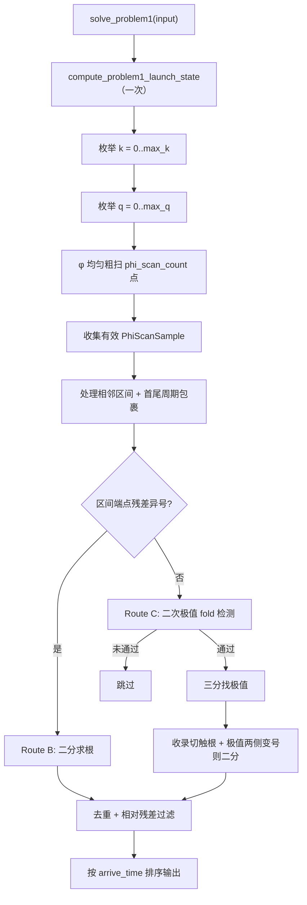

# Problem 1 求解器现状

## 实现位置与角色

活跃实现位于：

- `include/spaceship_cpp/problem1/problem1.hpp`
- `src/problem1/problem1.cpp`

入口函数：`solve_problem1(const Problem1SolveInput& input)`。

当前角色：

- Problem 1 的**正确性基准**（ground truth）
- 测试与诊断程序使用的转移时间候选来源
- BFS 首段边扩展（仅 P1）的在线求解后端

与 `Problem1Table` 的关系：表格模块是独立的端点几何 + 飞行时间离散实验，**不参与** `solve_problem1` 的在线求根流程。

---

## 核心数学问题

固定：

- 出发/目标行星
- 发射时刻 `t_launch`
- 转移轨道近日点全局角 `θ_A`

对遇合全局角 `φ ∈ [0, 2π)` 定义残差：

\[
f(\varphi) = T_\text{transfer}(\varphi) - T_\text{target}(\varphi)
\]

其中 \(T_\text{transfer}\)、\(T_\text{target}\) 为无量纲时间（未除以 \(\sqrt{\mu}\)）。求根目标是使 \(f(\varphi) \approx 0\)。

**重要耦合**：\(f(\varphi)\) 并非简单三角函数。随 \(\varphi\) 变化，转移轨道离心率 \(e(\varphi)\)、半通径 \(p(\varphi)\)、相对角 \(\xi_1(\varphi),\xi_2(\varphi)\) 与 \(\Delta F(\varphi)\) 都会更新，因此导数估计与 fold 处理必须基于完整 `evaluate_problem1_residual()`，不能用固定 \(e\) 的简化模型。

多圈分支：对 `transfer_revolution = k`、`target_revolution = q` 枚举，在每个分支上独立对 \(\varphi\) 求根。

---

## 残差评估基础

每次评估调用链：

1. `compute_problem1_launch_state()`：在 \(\varphi\) 扫描前**只算一次**，缓存发射时刻出发/目标行星状态（与 \(\varphi\) 无关的部分）。
2. `evaluate_problem1_residual_with_launch_state()`：给定 \(\varphi,k,q\) 计算完整 `Problem1ResidualResult`。
3. 对外接口 `evaluate_problem1_residual()`：单次调用时自建 launch state。

失败状态（`InvalidBranch`、`SingularGeometry` 等）的样本在粗扫阶段**跳过**，不进入后续区间处理。

---

## 求解全过程

### 总览

### 阶段 1：粗扫（Route A 前置）

| 项目 | 当前默认 |
|------|----------|
| 网格 | \(\varphi_i = 2\pi \cdot i / N\)，\(i=0,\ldots,N-1\) |
| `phi_scan_count` \(N\) | **120**（步长约 **3°**） |
| 存储 | 仅保留 `Success` 且 residual 有限的 `PhiScanSample{phi, result}` |

粗扫结束后，对**相邻有效样本**构成的每个区间 \([\varphi_L,\varphi_R]\) 调用 `process_phi_scan_interval()`。另外处理**周期包裹区间** \([\varphi_\text{last}, \varphi_\text{first}+2\pi]\)。

导数估计（供 fold 路线使用，**不增加残差调用**）：

| 函数 | 方法 |
|------|------|
| `estimate_residual_derivative_at_sample` | 内点中心差分；边界单侧差分 |
| `estimate_problem1_residual_derivative_central` | \((f_{i+1}-f_{i-1})/(\varphi_{i+1}-\varphi_{i-1})\) |
| `estimate_problem1_residual_derivative_at_left_endpoint` | 前向差分 |
| `estimate_problem1_residual_derivative_at_right_endpoint` | 后向差分 |

### 阶段 2：区间处理 — Route B（变号 → 二分，主路线）

**触发条件**：`residual_sign_changed(f_L, f_R)`（含一端为零）。

**流程**：

1. 若端点 \(|f| \le\) `residual_tolerance`，直接尝试收录候选。
2. 否则调用 `bisect_problem1_residual_on_interval_with_launch_state()`：
   - 区间二分，最多 `max_bisection_iterations`（默认 80）次；
   - 终止于 `residual_tolerance` 或 `phi_tolerance`（默认 \(10^{-10}\) rad）。
3. `refine_problem1_root_by_bisection()` 将 refinement 转为 `Problem1Candidate`。

这是传统「粗扫 + 变号括号 + 二分」路线，覆盖绝大多数普通根。

### 阶段 3：区间处理 — Route C（同号 → 二次 fold 门控 → 三分 + 双侧二分）

当区间**同号**时，尝试捕获 **fold / tangent**（切触零点、无粗网格变号）根。

#### 3a. 检测（纯算术，`detect_fold_interval_by_quadratic_extremum`）

**几何门控**（同时满足）：

- \(f_L \cdot f_R > 0\)（同号，变号路线已排除）
- \(f'_L \cdot f'_R < 0\)（端点导数异号 → 区间内有极值）
- `estimate_problem1_residual_quadratic_extremum_on_interval()` 给出内点极值 \(t^* \in (0,1)\)

二次 Hermite 模型（归一化 \(t \in [0,1]\)，\(\varphi = \varphi_L + t h\)）：

- \(\hat f(0)=f_L,\ \hat f'(0)=h f'_L,\ \hat f'(1)=h f'_R\)
- 极值点：\(t^* = -f'_L / (f'_R - f'_L)\)
- 预测残差：\(\hat f(t^*)\)（闭式）

**机制门控**（满足其一即可，**无端点近零门控**）：

- 相对深度：\(\rho = |\hat f(t^*)| / \max(|f_L|,|f_R|) < 0.5\)
- 相对预测：\(|\hat f(t^*)| / S < 10^{-4}\)，其中 \(S=\max(S_L,S_R)\) 为残差尺度

未通过则跳过，不进入三分。

#### 3b. 精修（`refine_fold_interval_by_quadratic_extremum`）

1. **三分法** `ternary_search_problem1_residual_extremum_on_interval`：
   - 在 \([\varphi_L,\varphi_R]\) 上假设单峰；
   - 极值类型由二次估计的 `is_minimum` 决定；
   - 最多 `kFoldTernaryIterations = 48` 轮。
2. **收录极值点**：三分结果若通过 `max_candidate_relative_residual`（默认 \(10^{-6}\)）则作为切触根候选。
3. **极值两侧二分**：若 \(f_L\) 与 \(f_\text{ext}\)、或 \(f_\text{ext}\) 与 \(f_R\) 变号，分别在子区间上走 Route B 二分。

### 阶段 4：候选汇总

- `add_candidate_if_not_duplicate()`：同 \((k,q)\) 且 \(\varphi\) 接近时保留相对残差更小者。
- 按 `arrival_time_seconds_since_j2000` 升序排序。
- 仅输出 `relative_residual ≤ max_candidate_relative_residual` 的候选。

---

## 公开搜索 API（可独立调用）

| 函数 | 作用 |
|------|------|
| `estimate_problem1_residual_derivative_*` | 离散点导数（纯算术） |
| `estimate_problem1_residual_quadratic_extremum_on_interval` | 二次 Hermite 内点极值（纯算术） |
| `detect_problem1_fold_interval_by_quadratic_extremum` | fold 区间检测（几何 + 机制门控） |
| `bisect_problem1_residual_on_interval` | 区间二分求根 |
| `ternary_search_problem1_residual_extremum_on_interval` | 区间三分找极值 |

`solve_problem1` 内部通过带 `launch_state` 的版本复用发射状态缓存；公开 API 单次调用时自建 launch state。

---

## 默认参数（`global_config`）

| 参数 | 默认值 | 说明 |
|------|--------|------|
| `phi_scan_count` | **120** | 粗扫点数（约 3° 一步） |
| `phi_tolerance` | \(10^{-10}\) | 二分角度容差 |
| `residual_tolerance` | 0 | 绝对残差容差（主要靠相对残差） |
| `max_bisection_iterations` | 80 | 每个变号区间最大二分次数 |
| `max_candidate_relative_residual` | \(10^{-6}\) | 候选验收阈值 |
| `max_transfer_revolution` | 0 | 默认 k 上界 |
| `max_target_revolution` | 0 | 默认 q 上界 |

性能测试与诊断可将 `max_k,max_q` 设为 1 或 2；benchmark 程序见下文。

---

## 正确性与性能（实测摘要）

对比程序：`apps/problem1_scan_compare.cpp`。

- **参考解**：`phi_scan_count = 2880`（步长 0.125°），同一套算法。
- **当前默认 120 步**：在 Earth→Mars/Venus/Mercury、`k,q ∈ {0,0}` 与 `{1,1}` 共 6 个场景下，与 2880 参考解 **matched 完全一致**（`missed=0`, `extra=0`）。
- **加速比**（相对 2880）：约 **10×～21×**（视场景与分支数而定）；Earth→Mars `k=q=1` 约 **0.23 ms vs 2.7 ms**。

更粗步长（96，3.75°）在相同测试集上仍通过，但默认取 120 作为效率与稳健性的折中。

---

## 可能的优化方向（保留建议，尚未实现）

按**性价比**排序，供后续迭代参考。

### 中等收益

1. **三分缩窗**：二次极值已给出 \(\varphi^*\)，仅在 \([\varphi^*-\delta,\ \varphi^*+\delta]\) 上三分，而非整个 3° 粗区间，可减少 fold 区间的残差调用。
2. **粗扫空洞处理**：`InvalidBranch` 导致有效样本不连续时，避免把跨空洞的宽区间当作单一区间；或在空洞两侧单独处理，降低漏根风险。
3. **Brent / 割线法替代二分**：括号已有后，收敛更快，每根可少 30%～50% 次残差评估。
4. **三分 + 少量 Newton 抛光**：在切触根附近用 1～3 步 Newton 代替「三分结果直接验收」。

### 大改动（BFS 大规模场景）

5. **残差内部热点**：`planet_true_anomaly_at_time` 的牛顿反解仍占单次 residual 大部分时间；可对固定 `t_launch` 进一步缓存目标行星相位或中间量。
6. **`(k,q)` 分支并行**：各分支粗扫独立，适合多核 BFS 扩展。
7. **自适应加密粗扫**：全局 120 格粗扫后，仅对变号/fold 阳性区间局部加密到等价 240～360 密度，兼顾平均速度与边界情况。
8. **`Problem1Table` 查表路线**：对重复行星对、相近 \((\nu_A,\theta_A)\) 的 BFS 批量调用，预计算 3D 表 + 局部插值可能优于纯在线扫；需单独评估建表成本与分支覆盖。

### 目前不建议

- 继续减小 `phi_scan_count` 作为默认（96 虽快但覆盖面变窄）。
- 去掉 fold 路线（120 步下它补的是无变号切触/折返根）。
- 回到全局 2880 均匀扫（实测对当前测试集无正确率收益）。

---

## 诊断与测试程序

| 程序 / 测试 | 作用 |
|-------------|------|
| `apps/problem1_solve_diagnostics.cpp` | 批量 solve，输出 CSV |
| `apps/problem1_scan_compare.cpp` | 不同 `phi_scan_count` 的正确率与耗时对比 |
| `apps/performance_benchmark.cpp` | P1/P2 与 BFS 扩展耗时评估 |
| `apps/problem1_profile.cpp` | 残差评估热点剖析 |
| `tests/problem1/test_problem1_solve.cpp` | 求解器集成测试 |
| `tests/problem1/test_problem1_residual_derivative.cpp` | 导数差分 vs 细步长数值导数 |
| `tests/problem1/test_problem1_quadratic_extremum.cpp` | 二次极值与 fold 门控 |
| `tests/problem1/test_problem1_phi_search.cpp` | 二分/三分基础 API |

---

## 与历史版本的对应

| 版本 | 特征 |
|------|------|
| Python `find_all_phi_roots` | 粗扫（默认 180）+ **仅变号二分**；fold/tangent 根有已知遗漏（代码内 TODO） |
| 早期 C++ | 720 点均匀扫 + 变号二分 |
| 高密度参考 | 2880 点 + 当前完整算法（benchmark 金标准） |
| **当前默认** | **120 点粗扫 + 变号二分 + 二次 fold 门控 + 三分 + 极值两侧二分** |
