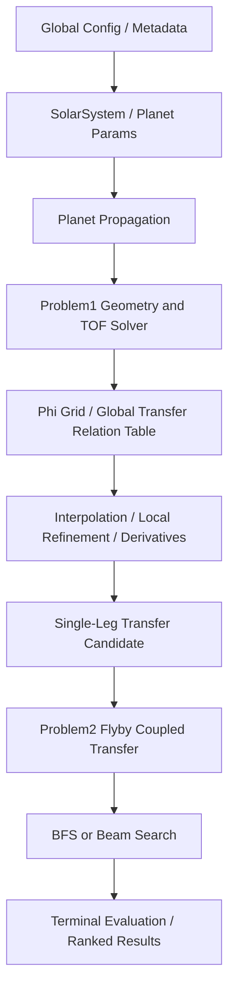
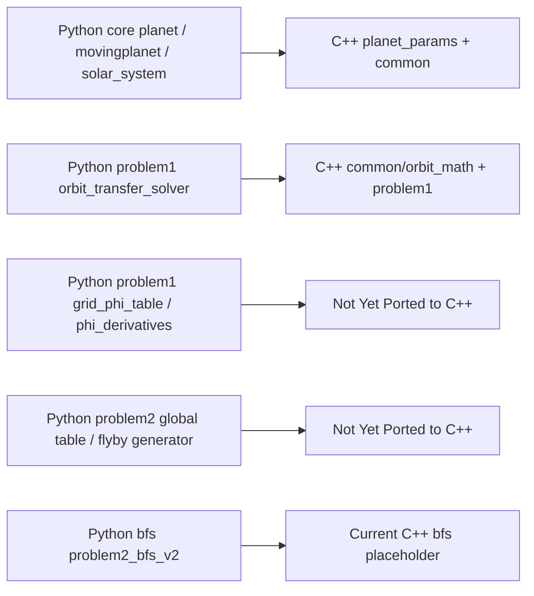

# Code Theory Framework

## 1. 总体目标

这个项目的总体目标是：在太阳中心二体近似下，为航天器搜索从出发天体到目标天体的可行轨迹，并进一步支持带中间引力辅助的多段轨迹搜索。

核心问题不是做高保真 N-body 仿真，而是做一套足够快、足够结构化的轨道几何搜索内核，用于：

- 给定出发天体、目标天体和可能的中间飞掠序列；
- 满足几何交会条件、飞行时间一致性和相对速度约束；
- 用尽量少的在线数值求解完成大量候选搜索。

原始暴力方法通常要同时枚举：

- 发射时间 `t`
- 初始相对发射速度大小
- 初始相对发射角
- 转移轨道参数
- 交会点轨道相位
- 多星体路径组合

这会导致搜索空间急剧膨胀。项目的演化方向因此变成：

- 先把轨道几何约束显式化；
- 把高频重复求解的超越方程离线构表；
- 在线阶段尽量只做插值、局部修正和约束过滤；
- 最后再把单段转移生成器和飞掠生成器接入 BFS/beam search。

需要明确：

- 当前 `spaceship_in_cpp` 主要实现了行星传播、`problem1` 单段转移求解和一个高层诊断表；
- 原始 Python 项目 `../spaceship` 还包含更完整的 `phi` 表、隐函数偏导、`problem2` 和 BFS 主线；
- 因此本文档会区分“当前 C++ 已实现”与“原始 Python 理论设计/后续接口”。

## 2. 基本物理与数学假设

### 2.1 太阳系与飞船动力学假设

代码整体采用 patched-conic / heliocentric two-body 近似：

- 行星围绕太阳做二维开普勒轨道运动；
- 航天器在两次 encounter 之间也视作太阳中心二体轨道；
- 行星飞掠用局部 patched-conic 关系近似；
- 当前重点是几何、时间和速度层面的搜索加速，而不是摄动、姿态、推力、N-body 高保真传播。

对于任意一段日心轨道，代码统一使用极坐标圆锥曲线形式：

$$
r = \frac{p}{1 + e \cos \xi}
$$

其中：

- `p` 是半通径；
- `e` 是离心率；
- $\xi$ 是相对于近日点方向的真近点角；
- 全局极角通常记为 $\lambda$ 或 $\phi$；
- 二者关系是 $\xi = \lambda - \omega$，其中 $\omega$ 为轨道近日点方向。

### 2.2 角动量、能量与轨道参数

二体问题下常见关系为：

$$
h^2 = \mu p
$$

$$
a = \frac{p}{1-e^2} \quad (e \ne 1)
$$

$$
\varepsilon = -\frac{\mu}{2a}
$$

其中 $\mu = GM_\odot$。

原始 Python `spaceship.py` 用状态向量反推：

- 比能 `specific_energy`
- 偏心率向量
- 半长轴 `a`
- 近日点幅角

见 `../spaceship/src/mission/core/spaceship.py`。  
当前 C++ 仓库没有直接保留“飞船状态向量 -> 轨道根数”的完整类，但在 `problem1` 中直接使用 $p,e,\xi$ 表达轨道。

### 2.3 飞行时间积分

当前 C++ 和原始 Python 都使用一个统一的时间积分原函数 `F`：

$$
F(e,\xi) = \int \frac{d\xi}{(1 + e \cos \xi)^2}
$$

并满足：

$$
\frac{\partial F}{\partial \xi} = \frac{1}{(1 + e \cos \xi)^2}
$$

于是轨道上从 $\xi_1$ 到 $\xi_2$ 的飞行时间可写为：

$$
t_{12} = \frac{p^{3/2}}{\sqrt{\mu}} \left[F(e,\xi_2)-F(e,\xi_1)\right]
$$

这正是当前 C++ `problem1` 残差的核心。  
对应实现：

- C++: `src/common/orbit_math.cpp`, `src/problem1/problem1.cpp`
- Python: `../spaceship/src/mission/problem1/orbit_transfer_solver.py`

### 2.4 椭圆 / 抛物 / 双曲分支

当前 C++ `orbit_F` 显式支持三类圆锥曲线：

- 椭圆 $e < 1$
- 抛物 $e = 1$
- 双曲 $e > 1$

见 `src/common/orbit_math.cpp`。

当前 C++ 中：

- 行星轨道传播只支持椭圆轨道，因为真实行星 $e < 1$，见 `src/planet_params/planet_params.cpp`
- `problem1` 对转移轨道允许出现 $e \ge 1$，并对双曲分支做了专门分支判断
- 对精确 $e = 1$ 没有单独的高层 special case；底层 `orbit_F` 有抛物公式，但 `problem1` 的分支逻辑主要按 $e < 1$ 与 $e \ge 1$ 区分，因此抛物情形属于边界情况，不是主工作区

原始 Python `spaceship.py`：

- 支持椭圆和双曲传播；
- 对抛物轨道直接报错 `Parabolic orbits are not supported for time propagation.`

因此需要明确：  
“抛物线已被统一理论覆盖”不等于“所有高层搜索流程都对 `e=1` 做了完整稳健支持”。

### 2.5 负离心率的规范化

当前 C++ `problem1` 对几何解出的负离心率采用标准规范化：

若解出 $e_{raw} < 0$，则改写为

$$
e = |e_{raw}|
$$

并把近日点方向平移 $\pi$：

$$
\omega' = \omega + \pi
$$

这样轨道几何保持不变，只是参数表示改成标准 $e \ge 0$ 形式。  
对应实现见 `src/problem1/problem1.cpp`。

### 2.6 交会几何约束

当前 `problem1` 的几何约束本质是：

1. 转移轨道经过出发点；
2. 转移轨道经过目标轨道上的某个交会点；
3. 飞船到达该点的飞行时间，等于目标行星从当前相位走到该点的飞行时间。

对于出发点 $(r_1,\xi_1)$ 和交会点 $(r_2,\xi_2)$，由

$$
r_1 = \frac{p}{1 + e \cos\xi_1}, \quad
r_2 = \frac{p}{1 + e \cos\xi_2}
$$

可解出：

$$
e = \frac{r_2-r_1}{r_1\cos\xi_1-r_2\cos\xi_2}
$$

$$
p = r_1(1 + e\cos\xi_1)
$$

这正对应当前 C++：

- `compute_transfer_e_from_two_points(...)`
- `compute_transfer_p_from_departure(...)`

## 3. 核心理论逻辑

### 3.1 原始问题为什么难

如果直接对任务做暴力搜索，通常需要同时枚举：

- 发射时间 `t`
- 初始速度大小
- 初始速度方向
- 转移轨道离心率、近日点方向等参数
- 交会点轨道相位
- 多次飞掠的中间状态

单段已经是高维非线性搜索；多段之后还会出现：

- 路径组合爆炸
- 每一段内部还要解超越方程
- 同一类几何关系被重复求解很多次

因此项目的总体思路不是“把 brute force 写快一点”，而是“换参数化方式，让搜索变量更少”。

### 3.2 如何用轨道几何约束减少枚举

项目试图把“速度向量枚举”改写成“轨道几何变量求解”。

例如把直接枚举：

- `v_r`
- $v_\theta$
- encounter time

改成更适合构表/插值的参数：

- 出发行星在发射时刻的全局极角
- 目标行星与出发行星的相位差
- 转移轨道参数角 $\theta_1$ / $\theta'$
- 交会点全局真近点角 $\phi$

然后通过：

- 轨道相交条件
- 飞行时间一致性
- 相对速度约束

把在线搜索压缩为少量变量的求根问题。

### 3.3 problem1：phi 表格的作用

这一部分主要来自原始 Python 项目 `../spaceship/src/mission/problem1/grid_phi_table.py` 和 `phi_derivatives.py`。  
需要先说明：当前 C++ 仓库里的 `src/problem1/problem1_table.cpp` 现在已经改成“每对有序行星一张带离散分支的几何表”。但这里还要区分：

- `k` branch 是几何确定后可普适预计算的 transfer branch
- `q` branch 依赖目标行星在真实发射时刻的起始 anomaly，因此不具备同样的 universal table validity

更准确地说，它有 three continuous angle axes and two discrete transfer-revolution branch axes；连续角轴是 $(\nu_A,\nu_B,\theta_A)$，离散 branch 轴是 $(k,q)$。不过当前 C++ 里把 `q` 存进 cell 的做法，只对一个“由 $\nu_A$ 模 $T_A$ 反推出来的代表性发射相位”成立，不能直接视为任意真实发射时间都通用。它不再使用“会合周期上的发射相位 × 近日点相对角”这类相对相位压缩，但 `q` 的 universal validity 仍然需要额外输入真实发射时间或 $\nu_{B,\text{depart}}$。

原始 Python 的 `phi` 表是一个 3D 全局关系表：

$$
\phi = \phi(\theta_0,\theta_1,\varphi_0)
$$

代码注释中三条轴的真实几何语义是：

- `theta0` 实际对应 $\alpha = \lambda_D - \omega_T$
- `theta1` 是转移轨道参数角
- `varphi0` 实际对应 $\beta = \lambda_T - \lambda_D$

其中：

- $\lambda_D$ 是出发行星当前全局极角
- $\lambda_T$ 是目标行星当前全局极角
- $\omega_T$ 是目标行星轨道近日点方向
- $\phi$ 是交会点的目标轨道真近点角/相关全局交会角变量，具体取值是通过超越方程求出来的

这张表之所以值得预计算，是因为在线求 $\phi$ 很贵：

- 每次都要解非线性几何 + 时间一致性方程；
- 还可能存在多根；
- 对后续飞掠与多段搜索会被高频调用。

因此，原始项目把这一问题离线化：

1. 固定 planet pair；
2. 在全局参数空间 `(alpha, theta1, beta)` 上均匀取网格；
3. 每个网格点用精确求解器解出 `phi`、`e`、`p`、残差和导数；
4. 查询时直接插值或局部修正，而不是重新全局搜索。

表格中通常存：

- `phi`
- `sin(phi)`
- `cos(phi)`
- `dphi/dtheta0`
- `dphi/dtheta1`
- `dphi/dvarphi0`
- residual
- status
- derivative_status

原始 `PhiGridTable` 就是这个结构。

关于 branch：

- 一个网格点理论上可能有多根；
- 原始 `PhiGridTable` 的早期版本主要保存单根和状态标记；
- 更后续的 `problem2/global_transfer_relation_table.py` 才明确引入 `max_branches`，把每个 cell/点按 branch 存多根；
- branch 不连续、跨 $\pm \pi$ 跳变、局部多根合并，都会导致 unwrap 和插值失败。

因此表驱动查询总会伴随：

- `status` 检查
- `phi unwrap` 检查
- 局部 refinement
- 必要时 fallback 精确求解

当前 C++ `problem1_table` 的修正重点是另外一个理论点：

- 旧设计若把两个椭圆轨道行星状态压缩成“相对角”或“会合周期中的相位”，在理论上是不充分的；
- 原因是椭圆轨道下，给定同一个 $\lambda_B-\lambda_A$，并不能唯一确定 $r_A,r_B$；
- 因此不能再假设
  “时间 $\to$ synodic 折叠 $\to$ 单个 relative phase $\to$ 转移几何”。

这一段需要明确区分两种不同方向：

1. 当前 C++ 已实现的是旧的 endpoint-table / transfer-time-table 方向  
2. 更符合 `solve_problem1` 真实语义的，应是 root-solution-table 方向

当前 C++ 已实现的旧方向可以写成：

$$
Table_{A \to B}(\nu_A,\nu_B,\theta_A; k, q)
$$

其中：

- $\nu_A$：出发行星 $A$ 在自身椭圆轨道上的 true anomaly
- $\nu_B$：到达行星 $B$ 在自身椭圆轨道上的 true anomaly
- $\theta_A$：转移轨道在出发点处、相对于转移轨道近日点方向的 true anomaly
- $k$：转移轨道额外绕日圈数，对应当前代码中的 `transfer_revolution`
- $q$：目标行星额外绕行圈数，对应当前代码中的 `target_revolution`

工程实现上，当前 C++ 不是把 $(k,q)$ 当成连续插值轴，而是采用：

$$
GeometryTable_{A \to B}(\nu_A,\nu_B,\theta_A)
$$

并在每个 geometry cell 内部保存 branch 列表：

$$
cell.branches[k,q]
$$

因此，更准确的表述是：

- `problem1_table` 有 3 个连续角变量轴：$\nu_A,\nu_B,\theta_A$
- `problem1_table` 还有 2 个离散 transfer-revolution branch 轴：$k,q$
- 插值未来只允许在前 3 个连续角轴上进行
- $(k,q)$ 只作为 branch identity 使用，不做连续插值

但还必须补一句理论限制：

- `k` 可以被视为由 geometry cell 普适决定的 transfer branch
- `q` 不能仅由 geometry cell 普适决定，因为它还需要目标行星在真实发射时刻的起始 anomaly $\nu_{B,\text{depart}}$

当前 C++ cell 中存放的 `target_true_anomaly_at_departure` 是通过：

1. 由 $\nu_A$ 反推一个模 $T_A$ 的代表性发射时间相位；
2. 再在这个代表性时刻上推进目标行星，得到一个代表性的 $\nu_{B,\text{depart}}$

因此，cell 内部现存的 `q` branch 应理解为：

- launch-phase-specific
- representative only
- 不能直接当作任意真实 `t_depart` 下都成立的 universal target branch

如果只从“endpoint geometry + transfer branch”角度做中间性预计算，那么从理论上更稳妥的设计是：

$$
Problem1Table_{A \to B}(\nu_{A,\text{depart}}, \nu_{B,\text{arrive}}, \theta_A; k)
$$

也就是只把 geometry 和 transfer branch `k` 做成普适预计算；然后在真实搜索或 query 阶段，给定实际发射时间 `t_depart`：

1. 计算 $\nu_{A,\text{depart}} = A(t_{\text{depart}})$
2. 计算 $\nu_{B,\text{depart}} = B(t_{\text{depart}})$
3. 查询表获得 transfer branch `k` 的飞行时间
4. 再在线计算目标行星从 $\nu_{B,\text{depart}}$ 到 $\nu_{B,\text{arrive}}$ 的 `q` 分支时间

这也是当前 C++ endpoint-table 版本在不大改结构时的较稳妥收口方式。若坚持把 `q` 也做成真正的 universal precomputed branch，则连续轴至少要升维到：

$$
Table_{A \to B}(\nu_{A,\text{depart}}, \nu_{B,\text{depart}}, \nu_{B,\text{arrive}}, \theta_A; k, q)
$$

也就是 4 个连续角轴加 2 个离散 branch 轴。

然后由端点全局极角差得到：

$$
\Delta \lambda = \operatorname{wrap}_{[0,2\pi)}(\lambda_B - \lambda_A)
$$

$$
\theta_B = \theta_A + \Delta \lambda
$$

当前 C++ 采用的就是这条加号约定；因为代码里
$\theta = \lambda - \omega_{transfer}$，
所以
$\theta_B - \theta_A = \lambda_B - \lambda_A$。

但是，这仍然不是我方最终推荐的 `Problem1Table` 理论结构。  
如果严格按照 `solve_problem1` 的真实输入输出语义来设计，`Problem1Table` 更应该是：

$$
Problem1Table_{A \to B}(\nu_{A,\text{depart}}, \nu_{B,\text{depart}}, \theta_A)
\to \text{sorted solution list}
$$

其中每个 solution 至少应包含：

- `varphi`
- `transfer_revolution = k`
- `target_revolution = q`
- `arrive_time`
- `transfer_time`
- `target_time`
- `residual`

也就是说：

- `k,q` 不是表格维度
- `k,q` 是 solve 输出解的 branch label
- 每个 cell 存的是一个按 `arrive_time` 排序的变长 root set

这与当前 endpoint-table 的区别是：

- 当前 endpoint-table 把 `\nu_{B,\text{arrive}}` 当成输入轴
- root-solution-table 则把 `\nu_{B,\text{depart}}` 当成输入轴，并把 encounter global angle 作为 solve 输出根

因此，当前 C++ 的这些接口：

- `query_problem1_table_exact(...)`
- `check_problem1_table_transfer_branch_interpolation_admissibility(...)`
- `query_problem1_transfer_time_with_interpolation_stub(...)`

都应理解为旧 endpoint-table 设计下的 experimental / transitional helper，而不是最终 `Problem1Table` 方向。

当前 C++ 的 `query_problem1_table_exact(...)` 仍然是“周期归一化后直接精确重算整个 geometry cell”的接口。`query_problem1_table_exact_branch(...)` 只会返回基于代表性 launch phase 重建出来的 $(k,q)$ 分支；如果要对某个真实发射时间做 target branch 计算，应使用显式输入真实 `t_depart` 的 branch exact query 接口。它们都不是插值器。后续如果要在这个连续 3D 几何表上做 branch-safe interpolation，至少需要同时满足以下准入条件：

- 所查询 cell 的 8 个顶点都 `valid`
- 8 个顶点的 `conic_type` 完全一致
- 8 个顶点的 branch signature 一致
- 周期边界附近必须先构造局部 unwrapped coordinate，再做局部插值
- 任一条件不满足时，必须 fallback 到 `query_problem1_table_exact(...)` 的精确重算

这里的 branch signature 至少应包含：

- branch 个数一致
- 每个 branch 的 `transfer_revolution` 和 `target_revolution` 都一致
- 椭圆/双曲分支顺序一致
- 没有 branch merge / branch split / 角度 unwrap 失败

因此，当前 C++ 文档不能把 `problem1_table` 说成“已经支持安全插值”；它目前只提供了之后实现插值所需的几何表和诊断基础。

#### Future Interpolation Admissibility: Geometry + k Only

这一小节只适用于当前旧的 endpoint-table / transfer-time-table 设计。  
如果未来切换到 root-solution-table，则这一整套 `geometry + k only` 的标量 transfer-time 插值假设需要被新的 branch-safe root matching 规则替代。

未来若在 `problem1_table` 上实现连续插值，插值只发生在以下 3 个连续角变量上：

- $\nu_{A,\text{depart}}$
- $\nu_{B,\text{arrive}}$
- $\theta_A$

这里的 admissibility check 必须只基于 geometry + `k`：

- geometry cell 的 8 个顶点都存在
- 8 个顶点的 geometry 都 `valid`
- 8 个顶点的 `conic_type` 一致
- 8 个顶点都存在同一个 `transfer_revolution = k` 的有效 transfer branch
- 周期边界附近需要先做 local unwrap，才能进入未来的插值阶段

必须明确：

- q does not participate in interpolation admissibility
- q does not participate in the 8-vertex interpolation branch signature
- q is evaluated online with real `t_depart` or `nu_B_depart`
- admissibility checks transfer-side k validity only
- representative q branch validity must not affect interpolation admissibility
- residual is evaluated later after real `t_depart` / `nu_B_depart` is known
- `branch.valid` may be too strong if it mixes transfer-side and target-side validity

还应固定一个 transfer-side 不变量：

- 对同一个 geometry cell 和同一个 `k`，不同 `q` 的 transfer-side 字段理论上必须一致
- 也就是 `theta_arrival_branch`、`deltaF_transfer`、`time_of_flight_scale_free`、`time_of_flight_seconds` 不应随 `q` 改变
- `q` 只影响 target-side time 和 residual，不应影响 transfer-side time

因此，future interpolation 更稳妥的做法是先从 cell 内部的 `(k,q)` 列表里提纯出一个 pure transfer branch view，再用这个 view 做 geometry + `k` 的 admissibility 和后续插值，而不是依赖任意一个 representative `(k,q)` branch。

另外，`1x1x1` 表只能作为 smoke test；真实的 8 顶点定位、周期 wrap 和 local unwrap 逻辑，必须在多网格表上单独验证。

#### Future Interpolator Stub

当前 C++ 还没有真正实现 transfer-time 插值器，但已经固定了一个 future interpolator stub 接口，用来作为后续 trilinear / Hermite 插值器的替换点。

这个 stub 的候选对象只有：

- transfer time(`k`)

它不负责：

- `q`
- target time
- residual

也就是说：

- `q` 在线计算
- residual 在线计算
- 当前 stub 只返回 geometry + `k` 对应的 transfer-side exact result

当前 stub 的工作流程是：

1. 先做 geometry + `k` 的 interpolation admissibility check
2. 若 admissible，则返回 pure transfer branch view 对应的 exact transfer-side 结果
3. 若 inadmissible，则返回 exact fallback / failure reason

因此，当前它虽然叫 interpolation stub，但并没有做真正插值；它只是为了把未来 transfer-time 插值器的外部接口固定下来。

### 3.3.1 Root-Solution-Table Draft

若按照 `solve_problem1` 的真实语义来重新定义 `Problem1Table`，更合理的数据结构草案应是：

```cpp
struct Problem1SolutionBranch {
    bool valid;
    double encounter_global_angle;
    double target_arrival_true_anomaly;
    int transfer_revolution;
    int target_revolution;
    double time_of_flight_seconds;
    double target_time_seconds;
    double residual_seconds;
    // optional:
    // double transfer_e, transfer_p, transfer_a, theta_B;
    // Problem1TransferConicType conic_type;
    // optional, only meaningful when converted from solve_problem1(...):
    // double arrival_time_seconds_since_j2000;
};

struct Problem1TableCell {
    double nu_A_depart;
    double nu_B_depart;
    double theta_A;
    std::vector<Problem1SolutionBranch> solutions_sorted_by_time_of_flight;
};
```

这个方向的关键点是：

- 表的连续轴应是 `nu_A_depart`, `nu_B_depart`, `theta_A`
- `encounter_global_angle` 不再是输入轴，而是 solve 输出根
- `target_arrival_true_anomaly = normalize(encounter_global_angle - target.orbit.theta_0)`
- `k,q` 不是表维度，而是 solution branch label
- root table 的核心时间量应是 `time_of_flight_seconds`
- `solutions_sorted_by_time_of_flight` 便于查询，但 branch-safe interpolation 不能只依赖排序

这里必须区分两个角变量：

- `encounter_global_angle`
  - 这是当前 C++ `solve_problem1` 和 `solve_problem1_from_departure_anomalies` 实际扫描/求根的主角变量
  - 它表示相遇点在日心全局坐标系中的极角
- `target_arrival_true_anomaly`
  - 这是目标行星在到达时刻、相对于自身轨道 `theta_0` 的 true anomaly
  - 它由

$$
target\_arrival\_true\_anomaly
= \operatorname{normalize}(encounter\_global\_angle - \theta_{0,B})
$$

  得到

后续若做 branch matching 或插值，必须明确到底是在比较：

- encounter global angle
- 还是 target arrival true anomaly

这里要特别修正一个时间语义：

- 若 `Problem1RootTable` 的输入只有 `nu_A_depart`, `nu_B_depart`, `theta_A`
- 那么它本身并不知道 absolute `t_depart`
- 因此它不应把 `arrival_time_seconds_since_j2000` 作为核心字段
- root table 能普适存储的时间量只能是：
  - `time_of_flight_seconds`
  - `target_time_seconds`
  - `residual_seconds`

只有当 branch 是由现有 `solve_problem1(...)` candidate 转换而来时，才可以额外携带：

- `arrival_time_seconds_since_j2000`

而且这时它只是一个附加诊断字段，因为：

$$
arrival\_time\_seconds\_since\_j2000
= t_{depart} + time\_of\_flight\_seconds
$$

当 `launch_time` 固定时：

- 按 `arrival_time_seconds_since_j2000` 排序
- 按 `time_of_flight_seconds` 排序

两者是等价的；但 root table 本体不应依赖这种 absolute 时间语义。

当前 C++ 仓库里已经新增了一个独立的 `Problem1RootTable Draft` 草案接口，并且已经接上了一个 lower-level solve 草案实现：

- 新增类型：
  - `Problem1RootTable`
  - `Problem1RootTableCell`
  - `Problem1SolutionBranch`
- 已新增的构表入口：
  - `build_problem1_root_table(const Problem1RootTableConfig&)`
- 已新增的 solve 输出转换入口：
  - `convert_problem1_candidates_to_solution_branches(...)`
- 已新增的底层 anomaly solve：
  - `solve_problem1_from_departure_anomalies(...)`

需要特别强调：

- 当前 `build_problem1_root_table(...)` 不会试图从 `nu_A_depart` 反推出唯一 `t_depart`
- 当前 `build_problem1_root_table(...)` 也不会使用 synodic period / relative phase 来压缩时间
- 当前 builder 已经能够直接调用 `solve_problem1_from_departure_anomalies(...)` 来填充 `solutions_sorted_by_time_of_flight`
- 当前如果需要与现有 `solve_problem1(...)` 做一致性比对，仍可以把带 absolute launch_time 的 candidates 转换为 `Problem1SolutionBranch`

这个 lower-level solve 接口现在已经以草案形式实现：

```cpp
solve_problem1_from_departure_anomalies(
    departure_planet,
    target_planet,
    nu_A_depart,
    nu_B_depart,
    theta_A,
    max_transfer_revolution,
    max_target_revolution
)
```

当前实现强调的是：

- 它不依赖 absolute `launch_time`
- 它不使用 synodic period
- 它不使用 relative phase
- 它不做 fake launch-time inversion

因此，`Problem1RootTable_{A->B}(nu_A_depart, nu_B_depart, theta_A)` 现在已经可以在不引入错误时间反推假设的前提下，直接填充每个 cell 的 `solutions_sorted_by_time_of_flight`。

这个 lower-level solve 的理论流程应是：

给定：

- `nu_A_depart`
- `nu_B_depart`
- `theta_A`

对每个候选 `encounter_global_angle`：

1. 计算 $A$ 在 departure 的位置
2. 计算

$$
target\_arrival\_true\_anomaly
= \operatorname{normalize}(encounter\_global\_angle - \theta_{0,B})
$$

3. 计算 $B$ 在该到达 true anomaly 下的位置
4. 由 $A_{depart}$、$B_{arrive}$、`theta_A` 确定飞船转移轨道
5. 枚举 `k`，计算 `transfer_time(encounter_global_angle, k)`
6. 枚举 `q`，计算 `target_time(nu_B_depart \to target_arrival_true_anomaly, q)`
7. 求解

$$
residual(encounter\_global\_angle, k, q)
= transfer\_time(encounter\_global\_angle, k)
- target\_time(\nu_{B,\text{depart}} \to target\_arrival\_true\_anomaly, q)
$$

8. 对每个 `(k,q)` 找所有 `encounter_global_angle` 根
9. 输出 `solutions_sorted_by_time_of_flight`

必须明确：

- 这个接口不应需要 absolute `launch_time`
- 这个接口不应使用 synodic period
- 这个接口不应使用 relative phase
- 这个接口不应做 fake launch-time inversion

如果未来要在 root-solution-table 上做插值，则 branch-safe matching 至少需要：

- `transfer_revolution = k` 一致
- `target_revolution = q` 一致
- 若同一个 `(k,q)` 下仍可能有多根，则还需要稳定的 root identity，例如 `root_index` 或连续延拓匹配
- `encounter_global_angle`、`target_arrival_true_anomaly`、`arrive_time` 在 8 顶点间局部连续
- 若出现 branch merge / split / disappear，则必须 fallback exact solve

因此，未来 root-solution-table 的 branch-safe interpolation 不再是：

- geometry + `k` scalar interpolation

而应是：

- branch-matched interpolation over a variable-size root set

这也是为什么当前的：

- pure transfer branch view
- `geometry + k only` admissibility
- transfer-time interpolation stub

都应视为旧 endpoint-table 设计下的中间产物，而不是最终方向。

推荐的未来查询流程应是：

1. 给定真实 `t_depart`
2. 计算 $\nu_{A,\text{depart}} = A(t_{\text{depart}})$
3. 计算 $\nu_{B,\text{depart}} = B(t_{\text{depart}})$
4. 对候选 $(\nu_{B,\text{arrive}}, \theta_A, k)$ 做 geometry + `k` admissibility check
5. 若通过，未来可插值得到 transfer time(`k`)
6. 对每个 `q` 在线计算 target time$(\nu_{B,\text{depart}} \to \nu_{B,\text{arrive}}, q)$
7. 用 residual = transfer time(`k`) - target time(`q`) 做后续筛选

因此，不要把 `q` 放进 future interpolation branch signature。

### 3.3.2 Root Residual Derivatives

当前 C++ 已经为 root-solution-table 新增了两层解析求导接口：

- `evaluate_problem1_root_residual(...)`
- `evaluate_problem1_root_residual_derivatives(...)`

以及 `orbit_F` 的解析偏导：

- `orbit_F_theta_derivative(e, theta)`
- `orbit_F_e_derivative(e, theta)`

其中：

$$
F_\theta(e,\theta)=\frac{1}{(1+e\cos\theta)^2}
$$

对椭圆分支 $e<1$：

$$
F_e(e,\theta)=
\frac{3eF(e,\theta)}{1-e^2}
-\frac{\sin\theta(2+e\cos\theta)}{(1-e^2)(1+e\cos\theta)^2}
$$

对双曲分支 $e>1$：

$$
F_e(e,\theta)=
\frac{\sin\theta(2+e\cos\theta)}{(e^2-1)(1+e\cos\theta)^2}
-\frac{3eF(e,\theta)}{e^2-1}
$$

这里的 root implicit equation 写成：

$$
R(\alpha;\nu_A,\nu_B,\theta_A,k,q)=0
$$

其中 $\alpha$ 是 `encounter_global_angle`。  
由隐函数定理：

$$
\frac{d\alpha}{dx}=-\frac{R_x}{R_\alpha},
\quad
x\in\{\nu_A,\nu_B,\theta_A\}
$$

因此当前 C++ 已实现：

- `R_alpha`
- `R_nu_A`
- `R_nu_B`
- `R_theta_A`
- `d_alpha_d_nu_A`
- `d_alpha_d_nu_B`
- `d_alpha_d_theta_A`

这些导数当前使用的是 scale-free residual；若换算到 seconds，只会整体除以 $\sqrt{\mu}$，在隐函数比值里会抵消。

有限差分目前只用于：

- 单元测试验证解析导数
- 后续必要时作为 debug / fallback 参考

而不是当前主求解路径。

当前解析导数会主动在以下区域返回 invalid：

- `e_raw < 0` 的负离心率规范化分支
- `e \approx 1`
- 几何分母 `D \approx 0`
- `R_alpha \approx 0`
- target unwrap 边界附近
- transfer unwrap 边界附近

这些区域后续若要做 branch-safe interpolation，仍应 fallback 到精确求解或局部数值修正。

### 3.3.3 Newton Refinement And Linear Prediction

当前 C++ 已经新增两类后续插值前置工具：

- `refine_problem1_root_branch_newton(...)`
- `predict_problem1_root_branch_linear_from_node(...)`
- `refine_problem1_root_branch_from_linear_prediction(...)`

它们的角色是：

- 预测器只负责生成 `encounter_global_angle` 初值
- Newton refinement 负责把这个初值重新拉回真正的 residual root

因此，无论未来使用：

- nearest seed
- trilinear interpolation
- 更高阶局部模型

都不应把预测值直接当作最终答案；都必须经过：

- residual check
- Newton refine

当前的最近邻一阶预测模型是：

$$
\alpha_{pred}
= \alpha_0
+ \frac{d\alpha}{d\nu_A}\Delta\nu_A
+ \frac{d\alpha}{d\nu_B}\Delta\nu_B
+ \frac{d\alpha}{d\theta_A}\Delta\theta_A
$$

其中角度差使用局部 wrapped difference。

当前的 Newton 更新是：

$$
\alpha_{n+1}=\alpha_n-\frac{R(\alpha_n)}{R_\alpha(\alpha_n)}
$$

每步后都会把 `alpha` 重新 normalize 到 $[0,2\pi)$，并保持：

- `transfer_revolution = k`
- `target_revolution = q`

不变。

当前 branch identity 暂时仍只使用：

- `k`
- `q`

如果未来发现同一个 `(k,q)` 下存在多根，则后续还需要补：

- `root_index`
- 或连续延拓 branch matching

二阶 Hessian fitting 计划推迟到下一步。未来局部二阶模型可写成：

$$
\alpha(x)\approx \alpha_0+\nabla\alpha_0^T\Delta x+\frac{1}{2}\Delta x^T H \Delta x
$$

其中 $H$ 是一个 $3\times 3$ 对称矩阵，有 6 个自由参数。  
但在进入这一步之前，必须先有：

- 可靠的 branch matching
- 稳定的 Newton refinement

所以当前阶段先停在：

- linear nearest prediction
- Newton refinement

而不直接实现二阶 Hessian fitting 或完整插值器。

### 3.3.4 First Root-Table Query Layer

当前 C++ 仓库已经新增了第一版 root-table query 层。它不是完整插值器，而是一个最小可用基线，专门服务于后续 branch-safe interpolation 的工程落地。

当前 query 层有两条路线：

- Route A：nearest-node linear Taylor seed + Newton refinement
- Route B：nearest-node quadratic raw approximation

其中 Route A 是当前可靠主路径。它的流程是：

1. 在 `Problem1RootTable` 上找到距离 query point 最近的 table node；
2. 取该 node cell 内的每条 solution branch；
3. 用节点上一阶导做 linear nearest prediction，得到 `encounter_global_angle` 初值；
4. 对每条 branch 调用 Newton refinement，把预测值重新拉回真正的 residual root；
5. 输出 query point 上的 refined branches，并按 `time_of_flight_seconds` 排序。

Route B 只用于评估二阶局部近似本身，不做 Newton。它的流程是：

1. 从最近 node 取同一条 branch；
2. 在该 node 处用隐函数一阶导的有限差分来估计一个 nearest-node Hessian；
3. 构造局部二阶模型：

$$
\alpha_{quad}
=
\alpha_0
+ \nabla \alpha_0^T \Delta x
+ \frac{1}{2}\Delta x^T H_0 \Delta x
$$

4. 直接在 `alpha_quad` 处调用 residual evaluator，得到 raw residual、time 和 transfer geometry；
5. 不做 Newton，因此它保留了二阶近似本身的误差特征。

当前 Route B 已支持两种 Hessian 估计方式：

- `TangentFiniteDifference`
- `NewtonRefinedFiniteDifference`

其中默认更推荐 `TangentFiniteDifference`，因为它更快，更符合 Route B 的 raw approximation 语义。  
当前 C++ 的 `quadratic nearest raw approximation` 默认仍然走 tangent Hessian，而不是 Newton-refined Hessian。

#### Tangent finite-difference Hessian

这是一种不在扰动点做 Newton 的 Hessian 估计方式。

已知节点上：

$$
\alpha_0,\quad
\nabla \alpha_0
$$

当输入坐标有一个小扰动 $\Delta x$ 时，先用切平面给出：

$$
\alpha_{tangent}
=
\alpha_0 + \nabla \alpha_0^T \Delta x
$$

然后直接在：

$$
(x+\Delta x,\alpha_{tangent})
$$

处调用 residual/derivative evaluator，得到扰动点的一阶隐函数导数。

对每个坐标方向分别做正负扰动，就能得到 Hessian 的三列近似：

$$
H \, e_i \approx
\frac{\nabla \alpha(x+h e_i)-\nabla \alpha(x-h e_i)}{2h}
$$

最后再对混合项做对称化。

这个方法的特点是：

- 不在扰动点做 Newton
- 比 Newton-refined Hessian 更快
- 本质上只是在切平面附近估计二阶项
- 所以必须额外做 residual 检查

当前实现里，tangent Hessian 已经落地为：

- `estimate_problem1_root_hessian_tangent_finite_difference(...)`

它会记录同一条 `(k,q)` branch 上 tangent stencil 的最大 residual 诊断量，包括：

- `tangent_residual_max_scale_free`
- `tangent_residual_max_seconds`

如果 tangent 点上的 residual 过大，则说明：

- 一阶切平面已经偏离同一条 root branch 太远
- 当前 Hessian 估计不可靠

此时该 Hessian 应直接返回 invalid / fallback。

相对地，`NewtonRefinedFiniteDifference` 会先把每个扰动点拉回同一条 `(k,q)` root，再对一阶导做中心差分，因此更慢，但更适合作为验证基准。

因此两种 Hessian 的角色应明确区分：

- `TangentFiniteDifference`：faster raw approximation candidate
- `NewtonRefinedFiniteDifference`：对照 / 验证工具，不是快速查询默认路径

这两条路线当前的角色分工是：

- Route A：给出最小可用 query 结果
- Route B：给出不带 Newton 的 raw approximation，用于比较速度与误差

因此，Route B 不能无条件信任。它必须带 admissibility gate，而不只是“算出来了就返回”。

当前 C++ 已经把 Route B 的诊断挂在 `Problem1RootApproximationResult` 上，用来回答以下三个层次的问题：

- Hessian 是否成功计算：`hessian_valid`
- raw residual 是否可评估：`raw_residual_scale_free`, `raw_residual_seconds`
- 这个 raw result 是否能暂时作为 fast approximation candidate：`admissible_for_fast_approximation`

当前 admissibility gate 至少会检查：

- Hessian 是否有效
- tangent stencil residual 是否过大
- raw residual 是否非有限
- raw residual 是否超过当前实验阈值

如果 gate 不通过，则 Route B 必须 fallback 到 Route A，而不应直接当作最终答案。

这里要强调两点：

- 当前默认 residual gate 只是实验值，不代表理论保证
- `tangent_residual_tolerance = 1.0` 只是当前默认实验参数；接口已经允许显式传入，不应被视为固定理论阈值

这也意味着 coarse grid 上的 tangent direct stencil 可用域是有限的。  
在局部 branch 几何已经明显偏离切平面时，Route B 会直接变成 inadmissible，而不是继续假装自己可信。

当前这第一版 query 层的边界非常明确：

- 还没有 8 节点 branch matching
- 还没有 8 节点 Hessian fitting
- 还没有 Hessian least squares
- 还没有完整 branch-safe trilinear interpolation
- 还没有 full interpolator / query ranking 层

当前实现仍然只依赖：

- 最近节点 branch seed
- 节点上一阶导
- 节点附近的有限差分 Hessian
- residual check
- Newton refinement

所以它应被理解为：

- first root-table query layer
- nearest-node baseline
- 后续优化前的可测量基线

未来可以加一个查询草案：

- `query_problem1_root_table_fast_with_fallback(...)`

建议流程是：

1. 先尝试 Route B tangent quadratic raw
2. 检查 `admissible_for_fast_approximation`
3. 若通过，则返回 `quadratic_tangent_raw`
4. 否则 fallback 到 Route A `linear + Newton`
5. 返回 `fallback_linear_newton`

但当前仓库还没有把这个接口正式接入主查询层；目前只把 fallback 策略写成 TODO / design note，而没有提前接到 `problem2`、BFS 或更高层路由里。

#### Problem1RootTable Resolution Sweep

当前默认测试里使用的 `Problem1RootTable` 分辨率只是 smoke-test / functionality-test 级别。  
例如当前 query 相关测试使用的是：

- `nu_A_count = 8`
- `nu_B_depart_count = 8`
- `theta_A_count = 12`

也就是一个 `8 x 8 x 12` 的小表，而不是高精度正式表格。  
因此，不能根据这个小表上的 coverage 直接否定 root-table 方法本身。

当前仓库已经新增了 `Problem1RootTable Resolution Sweep` 测试，用于比较：

- `8x8x12`
- `12x12x24`

在启用环境变量：

- `RUN_EXPENSIVE_ROOT_TABLE_SWEEP=1`

后，还会额外尝试更大的表，例如：

- `16x16x32`
- `24x24x48`

而 `32x32x64` 当前只保留为 TODO / optional target，不默认强行执行，以避免把昂贵 sweep 塞进默认 `ctest`。

这个 sweep 的目标不是证明 Route B，而是专门回答 Route A coverage 的问题：

- 如果 resolution 提高后 coverage ratio 明显上升，missing branch count 明显下降，
  那么 table resolution 很可能是主要因素；
- 如果高分辨率下 coverage 仍然很低，
  则更可能是 nearest-node seed pool 不足、同一 `(k,q)` 多根导致的匹配歧义，
  或 Newton basin / branch identity 本身仍不稳。

因此，若高分辨率后 coverage 仍低，下一步更应优先考虑：

- multi-node seed pool
- 更稳的 branch matching / branch identity

而不是继续把精力放在 Route B 上。

Route B 当前仍然只是 experimental raw approximation，不是主路径，也不是 coverage 的主要解决方案。

#### Virtual 2-Degree Nearest-Node Experiment

低分辨率 `8x8x12 -> 12x12x24` sweep 只能说明 smoke-test 表格上的最近邻行为，离最终目标仍然太远。  
因此当前仓库又新增了一类更接近最终目标的实验：

- `Virtual 2-Degree Nearest-Node Experiment`

它不直接构建完整 `2°` 表，而是对每个 query point：

1. 按 `2°` 周期角网格找到最近邻 virtual node
2. 只对这个 node 临时调用一次 `solve_problem1_from_departure_anomalies(...)`
3. 对 node branches 计算一阶导
4. 用 linear Taylor prediction 生成 query seed
5. 同时对 query point 做 exact solve
6. 分别统计：
   - linear raw
   - linear + Newton refinement

这样做的意义是：

- 它直接模拟未来 `2°` 完整表在“最近邻 seed”层面的质量
- 但不会真的去构建 `180^3 = 5,832,000` 个节点的全表

当前 `2°` 网格的三个角轴都是：

- `nu_A_depart`
- `nu_B_depart`
- `theta_A`

若步长取 `2°`，则每轴约有：

- `180` 个节点

因此总节点数约为：

- `180^3 = 5,832,000`

当前 virtual 实验还会额外统计：

- unique virtual node 数量
- 平均一次 node solve 的耗时
- `avg node solve time * 180^3` 的完整表构建时间估计
- 理想并行下的小时/天量级估计

这比 `8x8x12 -> 12x12x24` 的低分辨率 sweep 更接近最终问题。

如果 virtual `2°` nearest-node 仍然 coverage 很低，则更可能说明：

- 只用一个最近邻 node 的 seed pool 不足
- `(k,q)` 还不是足够强的 branch identity
- 需要 multi-node seed pool 或更细的 branch matching

当前 virtual `2°` nearest-node 实验还给出了一个很关键的中间信号：

- same `(k,q)` seed 在最近 `2°` node 上通常并不缺
- 但 raw linear seed 往往离 exact root 仍然很远
- Newton 即使把 residual 收敛到很小，也可能掉到同一 `(k,q)` 下的另一条 root

因此，现阶段不能直接把结果解释为：

- `2°` 表本身不可行

更合理的解释通常是：

- Newton basin 还需要审查
- branch identity / branch matching 还不够强
- 样本分布需要拆开看 near-node / mid-cell / physical 三类

也就是说，当前证据更像是在提示：

- 不要因为 virtual `2°` 的单最近邻失败就否定完整 `2°` root table
- 下一步应优先 audit Newton refinement
- 同时拆解 `solve_problem1_from_departure_anomalies(...)` 的单点耗时组成

如果 virtual `2°` nearest-node seed 表现已经不错，则完整表就更值得继续考虑。

无论如何，这个实验都不意味着当前要：

- 接入 `problem2`
- 接入 BFS
- 做 `8` 节点 Hessian fitting
- 做完整 branch-safe trilinear interpolation

它只是一个面向最终 `2°` 表的 nearest-node feasibility probe。

当前主线仍然是：

- audit Newton refinement
- profile `solve_problem1_from_departure_anomalies(...)`
- 给 `2°` 全表构建时间一个更可靠的 serial / ideal-parallel 估计

而不是继续扩展 Route B。Route B 当前仍然不是主线路径。

#### Residual Derivative Fallback and Newton Audit

当前仓库已经新增了一轮更细的 Newton / derivative audit，结论非常明确：

- Newton 更新公式本身 `alpha_next = alpha - R / R_alpha` 没有先验错误
- `R` 与 `R_alpha` 也使用同一套 scale-free residual 语义
- 但 analytic derivative evaluator 在 exact root 附近会大量返回 invalid

这意味着：

- Newton 失败更像是 derivative availability 问题
- 而不是 Newton 公式本身错误

当前 audit 暴露出的最主要 invalid 类型是：

- `analytic derivatives are unsupported for negative-e normalization branch`

这正好对应 residual evaluator 与 derivative evaluator 的一个关键不一致：

- residual evaluator 允许 `transfer_e_raw < 0`
- 并会把它 canonicalize 到 `|e|`，同时配合 perihelion / angle shift 继续求值
- derivative evaluator 却直接把这类 branch 判成 unsupported

因此会出现：

- residual valid
- exact root 存在
- 但 analytic derivative invalid

这就是当前 Newton 和 `attach_problem1_root_derivatives(...)` 失败的主要直接原因。

为此，当前仓库已经补入一层 finite-difference residual derivative fallback：

- 它直接对 residual evaluator 做中心差分
- 固定同一 `(k,q)`，不做 Newton
- 先估 `R_alpha, R_nu_A, R_nu_B, R_theta_A`
- 再通过隐函数关系恢复 `d alpha / d x`

它不是最终最优解，也不是长期希望依赖的主方案；当前目的只是：

- 先验证 Newton 失败是否主要来自 analytic derivative availability
- 如果 fallback 能显著改善 small-perturbation Newton，就说明下一步应回头修 analytic derivative evaluator
- 如果 fallback 也失败，则说明问题更深，可能在 branch identity、unwrap continuity 或 residual geometry 本身

当前证据表明：

- finite-difference fallback 确实能把一部分 exact-root 小扰动 Newton 拉回正确 root
- 因此下一步更应优先修 analytic derivative evaluator 的 canonicalization / unwrap 一致性
- 而不是继续扩展 Route B、BFS、或复杂插值层

#### Analytic Derivative Canonicalization for Negative E

这里的 `transfer_e_raw < 0` 不是一个“物理上无效”的 branch 标记。  
它只是说明：

- 用当前两点几何公式写出的 raw eccentricity 带了一个符号
- residual evaluator 会把它 canonicalize 到等价的正 `e`

当前 residual 侧采用的语义是：

- `e = |e_raw|`
- 当 `e_raw < 0` 时，把 transfer perihelion direction 平移 `pi`
- 等价地，把 transfer-side canonical angles 一并平移 `pi`

也就是：

- `theta_A_canonical = theta_A_raw + pi`（模 `2pi`）
- `theta_B_canonical = theta_B_raw + pi`（模 `2pi`）

在这个 canonical 变量下：

- `p` 保持不变
- target side 的 `q` / target unwrap 规则不需要因为 `e_raw` 符号而改变

因此 analytic derivative 也必须对同一组 canonicalized variables 求导，而不能：

- residual evaluator 用 canonical `e > 0`
- derivative evaluator 却在 `e_raw < 0` 时直接报 unsupported

当前修复后的 analytic derivative 采用：

- `e = |e_raw|`
- 对 `e` 的导数直接在 canonical geometry 上计算
- `theta_A` / `theta_B` 的 `+pi` shift 是常数平移，因此导数本身不变
- transfer time derivative 使用 canonical `Delta F_t`

特别地，转移时间必须使用：

- canonical `theta_A`
- canonical `theta_B_star`

其中 `theta_B_star` 仍然要保留与离散 `k` 一致的 unwrapped branch 终点。  
如果这里误用几何两点版本的原始 `theta_B`，则 `F_e` 项会和 residual evaluator 脱节，尤其在 `k > 0` 时会直接把解析导数符号或量级搞错。

修复后：

- negative-`e` branch 不再默认 analytic invalid
- finite-difference fallback 仍然保留，但主要作为 safety net
- 如果 analytic 与 finite-difference 重新一致，fallback 使用率应下降到接近零

#### Newton Residual Tolerance Units

当前 Problem1 root Newton refinement 内部比较的是：

- `residual_scale_free`

而不是：

- `residual_seconds`

两者关系是：

- `residual_seconds = residual_scale_free / sqrt(mu)`
- 因此如果调用侧想指定 seconds tolerance，必须先做：
  `residual_tolerance_scale_free = residual_tolerance_seconds * sqrt(mu)`

也就是说，传给 Newton 的 `residual_tolerance` 参数语义是：

- scale-free residual tolerance

不是 seconds tolerance。

因此当前接口语义分成两层：

- 原始接口保留 scale-free residual tolerance：
  `refine_problem1_root_branch_newton(...)`
  `refine_problem1_root_branch_newton_diagnostic(...)`
  `refine_problem1_root_branch_from_linear_prediction(...)`
  `query_problem1_root_table_linear_newton(...)`
- 推荐外部调用侧优先使用 seconds wrapper：
  `refine_problem1_root_branch_newton_seconds(...)`
  `refine_problem1_root_branch_newton_diagnostic_seconds(...)`
  `refine_problem1_root_branch_from_linear_prediction_seconds(...)`
  `query_problem1_root_table_linear_newton_seconds(...)`

seconds wrapper 内部统一调用：

- `problem1_residual_seconds_to_scale_free(...)`

这样可以保持内部 Newton 实现仍然只处理 scale-free residual，同时避免外部再次把 seconds tolerance 直接误传给 scale-free 接口。

此前测试里曾直接把：

- `1e-10`
- `1e-12`

这样的数值当成 `residual_tolerance` 传给 Newton。  
如果把这些值误解成 seconds tolerance，那么实际传进去的 scale-free 阈值就会极端偏小，结果是：

- Newton 已经把 seconds residual 压到非常小
- 但仍然因为 scale-free 收敛判据过严而被判 invalid

在把 seconds tolerance 显式转换成 scale-free tolerance 之后：

- small-perturbation Newton success count 大幅上升
- invalid refinement count 大幅下降
- 这说明问题不是 Newton 公式 bug
- 也不是 derivative bug
- 而是 tolerance unit mismatch

当前与 Route A 相关的直接结论也随之更新：

- 早期 root-table coverage 过低的主因，是 Newton residual tolerance 的单位传错，而不是 root-table 思路本身失效
- 在修正 tolerance unit mismatch 之后，Route A 的 query accuracy 已恢复到和 exact solve 一致的分支覆盖
- 因此不应再根据旧的 `8x8x12` / `12x12x24` 低 coverage sweep 结果，直接否定未来 `2°` root table 的可行性

接下来是否值得正式构建 `2°` full table，应该主要看：

- Release build 下 `solve_problem1_from_departure_anomalies(...)` 的单点耗时
- 以及 virtual `2°` nearest-node experiment 在更广样本上的查询收益

这里的 Release solve benchmark 只统计：

- 单点 `problem1 solve`

不包含：

- IO
- 任务调度
- attach derivatives
- Hessian
- 更高层 query / interpolation 逻辑

因此 `2°` full table 的构建时间估计，应当把 Release solve benchmark 当成乐观下界，而不是完整生产成本。

### 3.4 problem2：二维/三维插值与隐函数偏导

原始 Python `problem2` 的目标，是把 `problem1` 的轨道关系进一步包装成可以高频调用的全局 transfer relation table，再服务于飞掠搜索和 BFS。

这里的高层思想是：

- 原问题里有多组联立超越方程；
- 其中一部分可以离线预解；
- 在线阶段只保留较少变量；
- 对表格结果做插值，再用局部精确求解修正。

广义隐函数定理形式为：

若

$$
F(x,y,z)=0
$$

并把 $z$ 视作 $x,y$ 的隐函数 $z=z(x,y)$，则

$$
\frac{\partial z}{\partial x} = -\frac{F_x}{F_z}, \quad
\frac{\partial z}{\partial y} = -\frac{F_y}{F_z}
$$

在原始 `phi` 表里，$z$ 对应 `phi`，$x,y$ 对应不同几何轴；于是可以求：

$$
\frac{\partial \phi}{\partial \theta_0},\quad
\frac{\partial \phi}{\partial \theta_1},\quad
\frac{\partial \phi}{\partial \varphi_0}
$$

原始代码里有三种导数策略：

- `analytic`：用解析推导公式，见 `phi_derivatives.py`
- `finite_difference`：对隐式方程做有限差分，见 `compute_phi_partials_by_implicit_function(...)`
- `both`：两者都算，只在一致时接受

它们分别负责：

- `analytic derivative`：快，适合批量构表，但依赖推导正确且远离奇异点
- `finite difference fallback`：更稳健，作为保底或交叉验证
- `domain check`：防止进入分母近零、多根切换、几何奇异、非有限值等坏区域

什么时候偏导不可用：

- 分母接近 0
- `Delta` 接近 0，说明隐函数局部不可稳定解
- 多根在局部合并
- `phi unwrap` 失败
- 对应点本身不是高质量成功根

原始 `problem2/global_transfer_relation_table.py` 在更高一层又做了一次 branch-aware 表格：

- 轴为 `alpha × theta_prime × beta`
- 每个格点最多存 `max_branches` 根
- 查询时可用 trilinear interpolation 得到 `(phi,e,p,residual)`
- 也可先插值得到 `phi`，再局部精确修正

因此，这里的“二维插值”更准确地说是：

- 在某些局部推导里把 `phi` 视为少数参数的隐函数；
- 在真正的全局 transfer relation table 中，在线查询主要是三维 cell trilinear/interpolated + refinement。

## 4. 代码框架说明

### 4.1 天体与轨道传播模块

原始 Python：

- `planet.py`
  - `Star`, `Planet`
  - 负责基础质量、半径、轨道半径、周期等静态参数
- `movingplanet.py`
  - `MovingPlanet`
  - 在 `Planet` 基础上加入偏心率、近日点方向、初始相位
  - 提供 `get_theta_at_time()`, `get_position_at_time()`, `get_velocity_at_time()`
- `solar_system.py`
  - `SolarSystem`
  - 负责加载行星数据、构造飞船、做 encounter 搜索、旧版 BFS 与各种几何辅助

当前 C++：

- `include/spaceship_cpp/planet_params/planet_params.hpp`
- `src/planet_params/planet_params.cpp`

职责：

- 保存八大行星 J2000 轨道参数；
- 根据时间 `t` 计算真近点角、半径、全局极角、二维位置；
- 提供太阳引力参数 `GM_sun`。

当前 C++ 的行星推进使用统一 `orbit_F` 时间积分反解真近点角，而不是 Python 里单独的开普勒方程 `E - e sin E = M` 形式。

坐标与单位约定：

- 二维日心极坐标/平面直角坐标
- 长度单位：米
- 时间单位：秒
- 角度单位：弧度
- 引力参数单位：`m^3 / s^2`

### 4.2 航天器轨道模块

原始 Python `spaceship.py` 的职责最完整：

- 用 $(r,\theta,v_r,v_\theta)$ 表示飞船瞬时状态；
- 反推出轨道根数；
- 推进位置与速度；
- 计算能量、角动量和轨迹采样。

它支持：

- 椭圆传播
- 双曲传播
- 抛物不支持时间传播

当前 C++ 仓库还没有一个与 `Spaceship` 等价的完整类。  
相近功能被拆分到了：

- `src/common/orbit_math.cpp`
- `src/problem1/problem1.cpp`

当前 C++ 更偏向“以轨道参数直接求解转移”而不是“先造飞船状态对象再传播”。

### 4.3 phi 表格与求导模块

这部分主要存在于原始 Python，而不是当前 C++。

- `grid_phi_table.py`
  - 构建 `PhiGridTable`
  - 存储 `phi/sin/cos/一阶偏导/residual/status`
  - 负责保存、加载、查询、局部 refinement
- `phi_derivatives.py`
  - 提供解析偏导、有限差分回退和诊断函数
- `build_phi_grid_table_demo.py`
  - 小规模构表脚本
  - 演示 finite difference / analytic / both 三种导数模式
- `compare_initial_launch_generators.py`
  - 比较旧扫描式初始发射候选生成与新解析/关系求解式生成

表格数据结构：

- `PhiGridTable`
  - 3D 轴：`theta0 × theta1 × varphi0`
  - 每个点存 `phi`、`sin(phi)`、`cos(phi)`、三个一阶偏导、residual、状态位

更后续的 `problem2/global_transfer_relation_table.py`：

- 3D 轴：`alpha × theta_prime × beta`
- 每个格点还带 `branch` 维
- 每个 branch 存：
  - `phi`
  - `e`
  - `p`
  - `residual`
  - `status`

序列化 / 缓存：

- Python `PhiGridTable` 自定义二进制/目录输出
- `GlobalTransferRelationTable` 使用 pickle，并带 metadata/hash/version
- 当前 C++ 仓库尚未迁移这些表结构；C++ 的 `problem1_table.cpp` 只是在线求解后的结果表，并输出 CSV

查询时的 cell 定位与插值：

- `grid_phi_table.py` 支持直接猜值、Taylor、sincos、Hermite-like 插值
- `global_transfer_relation_table.py` 主打 trilinear interpolation
- 对 branch 会先检查 cell 顶点是否全有效，再做 `phi unwrap`
- 若插值候选残差不够好，走 local refine，必要时 fallback 到 exact solver

需要明确：

- 原始代码里“全 64 DOF tricubic Hermite”并未完成；
- 当前实现主要是 trilinear 和简化 Hermite-like 局部方法；
- 因此文档中不应把它描述成“已经完成严格高阶 Hermite 插值器”。

### 4.4 搜索流程模块

统一看，项目的理想 pipeline 是：

1. 读取全局参数；
2. 初始化太阳系与行星；
3. 构造或加载 transfer/phi 表；
4. 枚举发射时间和少量几何参数；
5. 用表格快速生成单段转移候选；
6. 计算飞行时间与目标相位一致性；
7. 检查交会处相对速度/捕获可行性；
8. 若有飞掠，调用 `problem2` 生成下一段耦合转移；
9. 进入 BFS/beam search；
10. 输出终端轨迹候选和审计结果。

当前实现状态分层如下：

- 当前 C++ 已实现：
  - 行星传播
  - `problem1` 单次转移求解
  - `problem1` 有序行星对连续 3D 几何表加内部离散 branch：$(\nu_A,\nu_B,\theta_A; k,q)$
  - diagnostics CSV 输出
- 原始 Python 已实现：
  - `phi` 关系表
  - 偏导/插值/局部修正
  - `problem2` 全局 transfer relation table
  - V2 BFS 路线
- 当前 C++ 未实现：
  - `problem2`
  - `bfs`
  - branch-aware global transfer relation table

## 5. 全局参数说明

### 5.1 当前 C++ 全局配置

当前 C++ 的集中配置在：

- `include/spaceship_cpp/config/global_config.hpp`
- `src/config/global_config.cpp`

关键参数包括：

- `max_transfer_revolution`
  - 默认 `0`
  - 转移轨道允许额外绕日圈数 `k`
  - 增大后搜索范围增大，但分支数和求根成本上升
- `max_target_revolution`
  - 默认 `0`
  - 目标行星允许额外绕行圈数 `q`
- `phi_scan_count`
  - 默认 `720` 或小表 `360`
  - 相遇角扫描密度
  - 影响漏根概率、运行时间
- `phi_tolerance`
  - 默认 `1e-10`
  - 二分求根收敛角容差
  - 影响精度和少量运行时间
- `residual_tolerance`
  - 默认 `0.0`
  - 绝对残差阈值，当前基本不用，主要依赖角容差和相对残差过滤
- `max_bisection_iterations`
  - 默认 `80`
  - 每个变号区间最大二分次数
- `max_candidate_relative_residual`
  - 默认 `1e-6`
  - 过滤伪收敛候选
- `departure_true_anomaly_count`
  - 小表默认 `8`
  - $\nu_A$ 维度离散数量
- `target_true_anomaly_count`
  - 小表默认 `8`
  - $\nu_B$ 维度离散数量
- `transfer_theta_departure_count`
  - 小表默认 `16`
  - $\theta_A$ 维度离散数量

这些参数主要影响：

- 精度：`phi_scan_count`, `phi_tolerance`
- 速度：`phi_scan_count`, `max_bisection_iterations`, 表格维度
- 搜索范围：`max_transfer_revolution`, `max_target_revolution`
- 结果可靠性过滤：`max_candidate_relative_residual`

### 5.2 原始 Python 中的参数组织方式

原始 Python 没有一个统一的 `config.py` 收口全项目参数。  
参数主要分散在：

- dataclass config
  - `Problem1TransferGeneratorConfig`
  - `Problem1LaunchThetaSolverConfig`
  - `Problem2FlybyGeneratorConfig`
  - `Problem1DrivenBfsConfig`
  - `GlobalTransferRelationMetadata`
  - `PhiGridMetadata`
- 各脚本默认值
  - `build_phi_grid_table_demo.py`
  - `compare_initial_launch_generators.py`
  - 各 `run_*.py`

典型重要参数：

- `alpha_count / theta_prime_count / beta_count`
  - 表格三轴划分
  - 影响精度、内存、构表时间
- `max_branches`
  - 每个网格点/单元最多保存多少根
  - 影响多根表达能力和内存
- `solver_tolerance`
  - 精确求解器容差
- `coarse_steps`
  - 初始粗扫步数
- `max_iterations`
  - 局部求根最大迭代次数
- `theta_prime_step_deg`
  - `problem2` 扫描角步长
- `near_zero_threshold`
  - 判断约束残差接近零的阈值
- `depth_limit`
  - BFS 最大深度
- `beam_width`
  - beam pruning 宽度
- `max_terminal_solutions`
  - 最大终端解数
- `time_tolerance`
  - TOF 一致性容差
- `min_transfer_time / max_transfer_time`
  - 转移时间过滤范围
- `table_path`
  - 关系表缓存路径

### 5.3 建议后续迁移到统一配置的硬编码项

当前仍有不少参数散落在代码或脚本里，建议后续迁移到统一配置层：

- C++ `problem1.cpp` 中的去重角阈值 `1e-8`
- Python 局部 refinement window
- fallback exact solver 的粗扫步数和迭代数
- `phi unwrap threshold`
- BFS 各 runner 默认的发射时间网格和角步长
- diagnostics 脚本里的 demo grid size

## 6. 数据流与调用关系

### 6.1 总体模块关系



### 6.2 当前 C++ 与原始 Python 的对应关系



## 7. 当前仓库的实现边界与后续开发接口

### 7.1 当前 `spaceship_in_cpp` 已完成

- `planet_params`
  - J2000 行星参数
  - 真近点角、半径、位置计算
- `common/orbit_math`
  - `orbit_F`
  - 椭圆/抛物/双曲时间积分
- `problem1`
  - 由几何两点解 `(e,p)`
  - 用时间残差做相遇角求根
  - 输出单次候选解
  - 构建高层 `launch phase × perihelion angle` 诊断表
- `config/global_config`
  - 第一版集中参数

### 7.2 当前未完成

- `problem2`
  - 仍是占位
- `bfs`
  - 仍是占位
- 全局 branch-aware transfer relation table
- 表驱动插值查询与导数缓存

### 7.3 建议的后续接口收口方向

建议后续 C++ 版本沿原始 Python 的理论主线补齐下列接口：

1. `Problem1ExactTransferSolver`
   - 输入 planet pair、时间、几何参数
   - 输出所有 branch-aware 单段解

2. `PhiGridTable` / `GlobalTransferRelationTable`
   - 明确 metadata、branch、status、residual
   - 提供 save/load/query/refine API

3. `Problem2FlybyOracle`
   - 输入 arrival state 与 flyby planet context
   - 输出 coupled transfer candidates

4. `SearchState`
   - 统一 arrival/departure 语义
   - 避免搜索层重复持有互相冲突的轨道参数

5. `BfsRunner`
   - 问题生成器、状态评分器、terminal evaluator 解耦

6. `Diagnostics`
   - 表质量评估
   - 导数验证
   - 插值误差审计
   - BFS profiling

## 8. 最后结论

这个项目的主线可以概括成一句话：

> 用轨道几何和飞行时间约束，把原本高维暴力枚举的轨迹搜索问题，逐步改写成“离线预计算表 + 在线插值/局部修正 + BFS 组合扩展”的层次化搜索框架。

当前 `spaceship_in_cpp` 已经实现了这条主线里最底层、最核心的一部分：

- 行星轨道传播
- 统一时间积分
- 单段转移几何与 TOF 残差求解

并且已经修正了一处重要理论错误：

- 不再用 synodic period / relative phase 作为椭圆轨道下的唯一几何状态压缩；
- `problem1_table` 现在显式区分连续几何轴 $(\nu_A,\nu_B,\theta_A)$ 和离散 branch 轴 $(k,q)$；
- 因此相同的 $\lambda_B-\lambda_A$、但不同的 $(\nu_A,\nu_B)$，会被视为不同几何点。

但更完整的 `phi` 表、隐函数偏导、`problem2`、branch-aware 全局关系表和 BFS 主搜索，目前仍主要存在于原始 Python 项目中，尚未迁移到 C++。

因此，后续开发最合理的方向不是继续堆叠新的脚本式求解器，而是把原始 Python 中已经验证过的：

- 关系表结构
- branch 语义
- 局部 refinement
- `problem1 -> problem2 -> BFS` 的接口边界

系统地移植到 C++ 版本。
